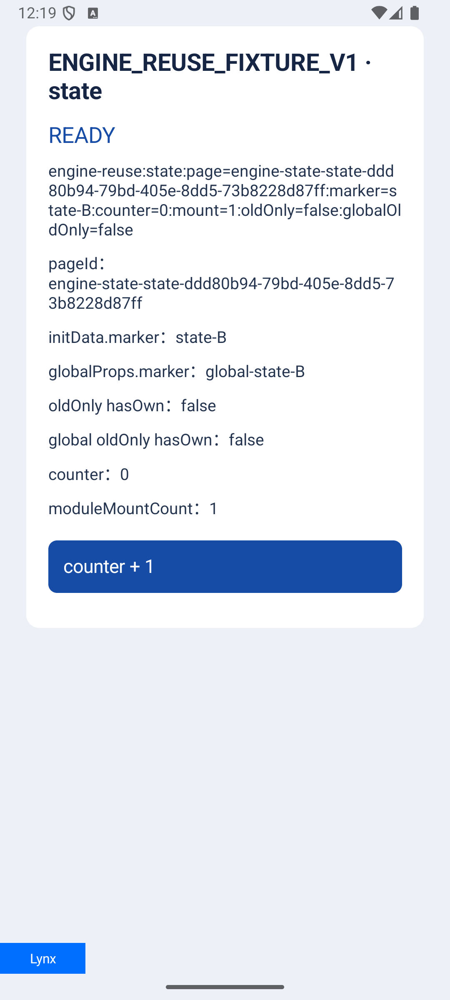
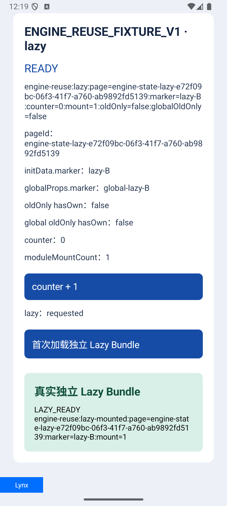

> 历史阶段报告：本文件记录此前关闭 Engine 缓存的安全解析方案。当前实现与最终验收请看 [有界 Engine 复用实测报告](BOUNDED_ENGINE_TEST_REPORT.md)。

# Android LynxViewGroup API 核验与安全模板缓存报告

执行日期：2026-10-10。Checkout：`codex/bundle-loading-opt`；main 基线 `b3837d491069dd5409d78dad75276201c54edaa3`。仅 Android；当前改动未提交、未推送、未合并。保留此前 Android/iOS Bundle 读取优化与用户 dirty 文件。

## 结论

**当前没有全面启用 Engine 缓存。** 本次固定 Lynx 4.1.0 / ReactLynx 0.123.3 的“销毁 A → 同 Group 新建 B”原型已证明：同一个 Engine 可以命中，但 B 页后台取得新参数时，UI 仍显示 A 页内容和 counter。不能把 Engine 对象相同当作新页正确。

最终主库使用官方 `LynxViewGroup` 缓存已解析的 `TemplateBundle`，明确 `setEnableCacheEngine(false)`、`setEnableSharedModule(false)`；每页创建新 Engine、UI、BTS 和 NativeModule。这保留相同已验证模板免重复主包读取/解析的收益，保持正常 SDK 首屏和新页生命周期。**原“全面 Engine 复用”目标仍未完成，也没有给 App 90 分。**

## 已读取的 skill 与 API

读取 `codex-dynamic-workflows`、`reactlynx-best-practices`、`lynx-typescript`、`lynx-devtool`，以及 Android 主库规则和项目地图。要求的 `lynx-api-docs/SKILL.md` 在已检索本机目录缺失，使用官方固定 tag 源码、本机 4.1.0 AAR 和已安装 ReactLynx 运行时核验，未声称加载缺失文件。

公开接缝为 `LynxViewGroupBuilder.setContext/setUrl/setTemplateBundle/setEnableCacheEngine/setEnableSharedModule/build`、`LynxViewBuilder.setLynxViewGroup`、`ILynxViewGroup.release`。资源 setter 返回 void，不能串到 `.build()`。预解析准确 API 是 `TemplateBundle.fromTemplate`。[官方集成说明](https://lynxjs.org/next/zh/blog/lynx-3-8.html#原生侧集成)、[固定 4.1 Builder](https://github.com/lynx-family/lynx/blob/4.1.0/platform/android/lynx_android/src/main/java/com/lynx/tasm/group/LynxViewGroupBuilder.java)、[TemplateBundle](https://github.com/lynx-family/lynx/blob/4.1.0/platform/android/lynx_android/src/main/java/com/lynx/tasm/TemplateBundle.java)

Group 的 engine 缓存只有一个空闲槽；并发 View 归还可能覆盖。最终池采用每个 slot 一个 active View，同身份并发分配不同 slot；active 失效先退休，退出后释放。解析对象只由 Group 持有和释放，不共享到多个独立释放的 Group。[SDK Group](https://github.com/lynx-family/lynx/blob/4.1.0/platform/android/lynx_android/src/main/java/com/lynx/tasm/group/LynxViewGroup.java)

## 为什么没有按原设想全面开启

先冻结测试，再在产品源码零改状态编译运行：并发用例通过；Small/Large/Async 六次真实渲染和 Native source 正确后，只因没有 Engine 复用产生预期 Red。

Engine 原型能取得相同真实 `LynxEngine` 对象和相同非零 wrapper pointer，但原型最终四项只有两项通过：State/Lazy 两项 Native B 数据已变，UI 仍显示 A。冻结探针未改成相同参数，也未放宽可见节点断言。[原型失败日志](evidence/grouped-instrumentation-4.log)、[原型源码](prototype-tests/EngineStateReuseTest.kt)

官方 Group Engine 复用能力本身可以用，本轮也观察到了真实 Engine 命中。失败结论仅适用于当前原型要求的全新页面语义，不能外推为整个版本的所有 Group 用法均不支持。

[代码事实 + 静态推断] ReactLynx 在 `isFirstScreenSynced` 已为 true 时不会再次走相关首屏 snapshot 同步，这与新 BTS 数据正确、旧 UI 残留的现象一致，是当前最有源码支持的根因候选。本轮没有直接采集该标记及 hydrate/patch 事件，也没有仅改变同步状态的控制对照，尚不能把这条实际执行链当作运行态根因已确证。只 `resetData` 不重开这条生命周期；公开 `reloadTemplate` 会在同一 BTS VM 重新挂载，模块作用域不重建，存在二次副作用。没有依赖内部 MTS 函数注入、delay 或假回执绕过。相关依据是已安装 0.123.3 的 `snapshot/lynx/calledByNative.js`、`snapshot/lifecycle/event/firstScreenSync.js`、`snapshot/lifecycle/reload.js` 与 `patch/updateMainThread.js`。

另外，cached Engine 正常不会再次发送 SDK `onFirstScreen`；原型曾测试独立 frame commit 门禁，但在可见 UI 仍旧时也不能当新页正确。最终安全方案删除这条原型，全部页面使用真实 SDK 首屏。[SDK Client/renderer](https://github.com/lynx-family/lynx/blob/4.1.0/platform/android/lynx_android/src/main/java/com/lynx/tasm/LynxTemplateRender.java)

## 最终主库接入链

`已验证 prepared + fixed sidecars → typed key → Group 首次后台读包/SHA/解析 → bounded parsed TemplateBundle → 新 LynxView/Engine/UI/BTS → SDK 首屏 + 原业务健康门禁`

- Factory 是统一入口，普通 Page 和 Native Tab 都传入 typed `PreparedActivityBundle`，不信任诊断 metadata 作为缓存身份。身份不足的 Direct/custom 来源保持原路径。
- Key 包含 app、主包、Release、SHA、用户 epoch、source/selection、资源快照与环境配置；sidecar 身份来自已验证内容字段，不能用 URL 相同推断内容相同。
- 下载/内置资源填入真实 SHA/size；View 只使用当前 fixed lease。资源请求支持同步/异步合同；关闭时取消全部 pending，迟到的新解析对象释放。
- 缓存最多 2 个空闲 Group、8 MiB **编码体积权重**、60 秒 TTL。8 MiB 不是 native 实际内存上限，也不限制仍 active 的页面数量。
- identity、host/runtime 替换、candidate 确认/失败、rollback、删除、低内存和配置变化均失效；有 active lease 的 Group 不提前释放。
- Native Tab GlobalProps 与 MessageHub 使用同一 pageInfo；`emitToNative` 按真实调用 View 寻址，修正同 Activity 多 View 串 source。
- 销毁记录创建时的 Native hosts，按 exact Context 结束任务，再 SDK destroy，再归还 Group。可选 LifecycleHost 与 MediaHost 共用 Context 签名，同对象实际实现 marker 时只调用一次；旧 Host 接口保留。

## 实际测试结果

| 验证 | 结果与边界 |
|---|---|
| JVM | 145 total；142 passed、3 skipped、0 failure/error。新增 Pool 15 项 + resource identity 6 项全部通过；三个既有外部 Server 用例未配置 origin而跳过。 |
| Debug APK/test APK | 编译成功，并安装到本机 `emulator-5554`，隔离 App `com.hugboga.custom.otae2e`。未操作已连接真机。 |
| Release 主库 | `:lynx-shell:assembleRelease` 成功，验证生产源码的调试块移除后仍可编译。 |
| 安全设备回归 | 9/9，通过相同 snapshot 的真实 TemplateBundle 对象/非零 native pointer、新非零 shell、engineRef=null、SDK 首屏、正确 Native/UI、并发、trim、取消、10 次往返和诊断。最终整套 17.828 秒。 |
| State/Lazy 截图 | 两项另行执行 2/2，10.689 秒；在行为断言后捕获真实屏幕。截图没有插入十次性能样本。 |
| Engine 原型 | 4 run / 2 pass / 2 fail，真实 UI 状态失效；保留原型，不能标为最终成功。 |

State A 实际点击到 counter=1；B 显示新 marker/pageId、counter=0、moduleMountCount=1，两个 oldOnly hasOwn=false。Lazy A 没有使用组件并关闭 lease；B 首次真实点击经过一次 Native `.lynx.bundle` fetch，响应 10,831 B、SHA `6a45080180574fdee001b284ce43e89103c9cd9b05877ae3d70248e983fb8c8b`，独立组件 UI 和 Native source 均归 B。

输入：Small 88,114 B、Large 3,234,076 B、十个真实 JS 的 Async 94,510 B；新增 State 92,382 B、Lazy 主包 165,880 B、独立 Lazy 10,831 B，固定 production Engine 4.1。使用本地 HTTP 文件服务和真实 Store stage/install/lease；不是本轮真实 selection Server / Admin 发布验收。

## 内存与速度能得出什么

首轮十次 Small 往返，在同一个 Debug 模拟器进程中没有主动 GC：READY PSS 为 197,004–201,640 KiB，destroy 后 188,996–198,032 KiB；第十次比第一次 destroy 后高 3,512 KiB（约 3.43 MiB）。测的是整个隔离 Sample，含 SDK、调试和系统资源，不能等同缓存本身大小。[原始样本](evidence/memory-and-timing.json)

SDK 布局首屏首个样本 36.572 ms，后九次中位数 20.328 ms。时间从 render 开始，到 SDK 首屏 layout callback；没有同口径配对 baseline，也未测实际屏幕呈现/点击至可交互 p95，所以不能据此宣称整体提升比例或 90 分。

WeakHost 在首次八次 GC 后未收集。第一 HPROF 的强根为 `Instrumentation → MessageQueue → ScrollabilityCache callback → old ScrollView → old LynxContext → destroyed Activity`，链上没有模板缓存。等待三秒并追加诊断 GC 后，第二 HPROF 只排除弱引用、保留其它 roots 的严格分析未找到该 Activity 的强根；它作为 unreachable 对象仍在 dump 中。**这说明本次可见强队列保留已消失，不是所有 Native 资源无泄漏证明；WeakReference 诊断记录仍为 false，没有改为成功。** 原始 heap 留在本机临时目录，不复制到项目/知识库。[首条根链](evidence/heap-analysis.txt)、[排空后严格分析](evidence/heap-after-drain-strict-analysis.txt)

## 交付与未完成项

`lynx-ui-auditor` 和 `android-kotlin-auditor` 复核最终安全方案，指定范围未发现剩余阻断；同步资源模式、迟到解析对象、prepared bytes 关闭、Host 去重等 finding 已处理。

本轮已完成有界解析缓存、页面身份/资源/销毁接线与上述 Android 验证。全面 Engine 复用、真实业务包/低端真机的 p95、Map/Video 等长期 Native 资源 footprint、十个活页并存、iOS/Harmony 的同等体感没有本轮证明。大包白帧交接方案仍是前轮设计，未在本轮实现。后续同 Engine 方案需要可靠的 ReactLynx onReuse/hydration 合同，并继续通过原型的可见状态和一次副作用断言；没有猜测哪个升级版本已经支持。

HTML 可视报告见 [TEST_REPORT.html](TEST_REPORT.html)；测试矩阵见 [TEST_CASES.md](TEST_CASES.md)。
