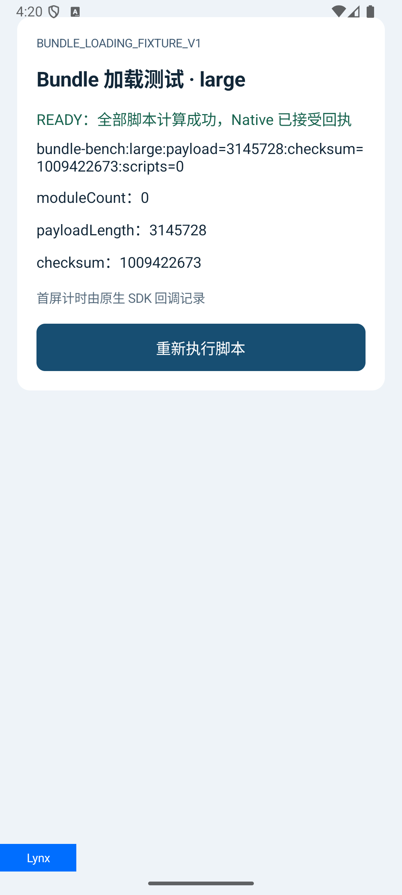
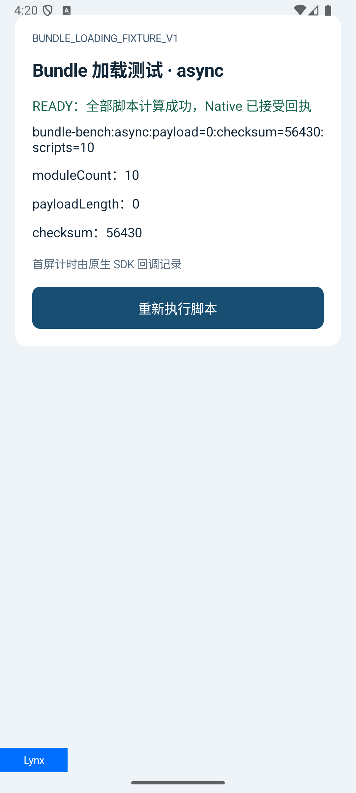
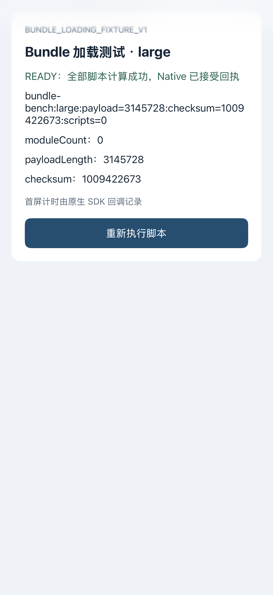
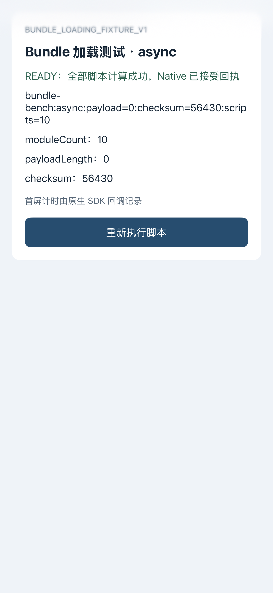

# Android / iOS Bundle 加载优化测试报告

日期：2026-10-09。实施分支：`codex/bundle-loading-opt`。远程 main 基线：`b3837d491069dd5409d78dad75276201c54edaa3`。

**已完成两端限定实现、测试先行的 Red/Green 回归，以及本机模拟器真实 Bundle 验证。已证实 Android 读取分配减少、重复清单读取减少，iOS 页级索引复用和 Tab 文件读取移出主线程。没有证实整体首屏提速，也没有 App 总内存、峰值 RSS 或“90 分”的验收证据。**

鸿蒙按用户要求暂缓，零产品修改、零设备验收。本轮范围是主 Bundle 与 Async 脚本加载链路；没有扩展到图片/字体解码、页面保留、GC 或下载架构。代码保存在新 worktree，未提交、未 push、未 merge。

## 1. 你实际获得了什么

| 改动 | 可确认的收益 | 证据 | 不能由此推出 |
| --- | --- | --- | --- |
| Android 主包定长数组直接读取 | 读取过程中少产生完整临时数组，降低累计分配压力 | 同一 3,234,076 B 主包连读 5 次，ART 近似分配 58,503,168 → 16,179,200 B，减少 72.34% | App 总内存降低 72.34%、零拷贝、Lynx 不保留模板/JS 内存 |
| Android 同次取包复用主/Async 清单 | 一次 warm lease 不重复读同一 JSON | 主清单 OPEN 3 → 1；Async 清单 2 → 1 | 全局永久缓存、取消 SHA 检查、网络请求减少 |
| Android 预置输入一次消费后清源 | Provider 不继续持有已交付的原始输入引用；close 清未消费源 | 字节实例/源字段、并发一次消费、4 个 close 时序用例通过 | 页面销毁后引擎堆立即下降、十页只有一份内存 |
| iOS 固定页级 Async 索引 | 同一页面后续请求不再依赖清单 JSON 的反复读取/解码/遍历 | prepare 后移除/损坏 JSON，十个目标仍正确读取；新 prepare 仍拒绝坏清单 | 不检查目标对象；没有索引元数据开销；整个 Release 只解析一次 |
| iOS Native Tab 后台文件读取 | 普通 Page 与 Tab 的实际主包 I/O 线程边界一致 | 所有 baseline Tab 正式样本 readOnMainThread=true；优化全部 false；Page 始终 false | 必然更快、内存映射没有分页成本、两端耗时相同 |

对“连续打开十个 Bundle”的直接回答：本次去掉的是读取时的额外完整缓冲和 Provider 的无用源引用。十个仍存活的页面可以各有自己的 LynxView、模板和 JS 状态；这些消费者内存没有被本次优化消除。本轮没有测十页并存、逐页返回和回到首页后的 footprint 曲线，不能据此承诺十页内存没有问题。

## 2. 测试顺序与已复现的问题

[测试用例](TEST_CASES.md) 和 Android/iOS 可执行回归先于产品行为修改落地。两端先运行旧实现，记录可运行的行为 Red，再开发并执行同一套断言。后续独立审查发现的问题也先补测试取得 Red，再修复，不改变阈值迁就数据。

| 阶段 | 实际结果 | 留存证据 |
| --- | --- | --- |
| Android 初始旧实现 | 13 项运行，6 通过 / 7 预期失败 / 0 errors；原字节边界仍正确，但源保留、额外分配、长度变化和重复清单读取暴露 | [baseline 原始日志](evidence/android-tests-baseline.log) |
| iOS 初始旧实现 | 编译成功；missing/corrupt 两个参数化 case 各十个目标失败，合计 20 个行为 issue；其余八个 case 通过 | [baseline 原始日志](evidence/ios-spm-baseline.log) |
| Android 审查 P2 | 排队任务提交后 close，清源导致任务 fallback 尝试联网；可控 Gate 取得 connectionAttempts=1、callbacks=0 的 Red | [关闭时序 Red](evidence/android-tests-queued-close-red.log) |
| Android P2 修复 | 用不可变 source 身份和 closed 门禁保留关闭契约；四个窗口加原 13 项全部通过，连接/失效回调为 0 | [最终 17 项 Green](evidence/android-tests-queued-close-green.log) |
| iOS 审查 P2 | byte 已拒绝歧义，但 localURL 仍返回路径；重复 URL 和 URL/path 冲突两项取得 Red | [path 歧义 Red](evidence/ios-path-ambiguity-red.log) |
| iOS P2 修复 | byte/path 共用 URL 与 requestKey 的唯一匹配；完整 Core 107 tests / 13 suites 通过 | [最终 Core Green](evidence/ios-spm-path-fix-full.log) |

先行基准方案缺少实际读取线程观测点，因此第二阶段增加最小 DEBUG 内部观察器，并同步到 baseline 与 optimized。没有把编译失败、调用 render 或 JS 发起事件当成真实首屏。

## 3. 固定输入与真实页面

复用用户模板已安装的依赖构建自建夹具：ReactLynx 0.123.3、Rspeedy 0.16.3、React 插件 0.18.3；原生 Lynx 4.1.0 / PrimJS 4.1.1。没有修改原模板、安装新版本或升级引擎。

| 夹具 | 实际主包大小 | 页面实际计算并由 Native 验证的结果 | SHA-256 |
| --- | --- | --- | --- |
| Small | 88,114 B | payload=0，checksum=0，scripts=0 | `bd55248f0883f4492245ecc18309d241eb419e992f4b2bacc00502294809fbe2` |
| Large | 3,234,076 B | 真实高熵 payload=3,145,728，checksum=1,009,422,673 | `3554ab411d9be7828d05029f42bcd77a5bacfaf50b43648865fbfe9e52505fbf` |
| Async | 94,510 B + 10 个外部 JS | 实际执行 scripts=10，checksum=56,430 | `374ddaf32e80cdb56a7b9e065d4fa1b3c0239e3da63221715e74ce354596da8c` |

Large 是合法可渲染 Bundle，数据参与运算；没有在二进制末尾填充无效字节冒充大包。Async 是十个实际被调用的外部 JS chunk，不能用“生成了 static 目录”代替执行证明。真实运行要求 SDK 首屏、UI READY/布局、Native ready 的 case/moduleCount/payloadLength/checksum 同时正确。

最终产物为 `/tmp/codex-bundle-loading-opt-20261009/implementation/fixture-final-out`，源码位于 [fixtures README](../../scripts/fixtures/bundle-loading/README.md)。元数据与 AST 启动前检查归档在 [fixture-metadata.json](evidence/fixture-metadata.json)。三主包内联脚本及十个外部脚本均检查到自由 `process` 引用为 0。

初期夹具误用非 production 产物出现 `Can't find variable: process`，测试输入和 Tab URL 配置也有失败尝试。这些失败已定位修正，保留原日志，但没有计入性能样本。最终两版均核对实际 App 输入：iOS 13 个文件 size/SHA 逐项相同，Android 三主包身份/输出相同；基线/优化使用相同 harness SHA。[输入与统计复核结果](evidence/input-evidence-verification.json)。

### 模拟器实际截图

截图取自真实运行，分别展示小包、大包、十脚本执行结果。完整 baseline/optimized 对照在 [evidence/screenshots](evidence/screenshots/)。









## 4. 各项用例结果

PASS 仅代表下表注明的断言和观察窗口。部分覆盖、未执行和暂缓没有被算作通过。

| ID | 状态 | 实际证据 / 验证边界 |
| --- | --- | --- |
| BL-A01 | PASS | 1 / 8191 / 8192 / 8193 / 2MiB / 20MiB 的完整字节一致；短读/变化有确定失败 |
| BL-A02 | PASS | 空、20MiB+1 拒绝，取消前检查、长度缩短/增长拒绝；20MiB 合法边界通过 |
| BL-A03 | PASS | 原输入实例交付、一次 claim 后清源；URL 不匹配不消费；并发一次消费；close 清源 |
| BL-A03-C | PASS | queued、claim 后、Call 登记前、登记后四个 gate 窗口；无连接/失效 callback，集合清理平衡 |
| BL-A04 | PASS | FileObserver OPEN 由目录 marker barrier 收口；warm lease 主/Async 从 3/2 降至 1/1；观察后才 close，排除 prune |
| BL-A05 | PASS | 非目标主包/其他 owner Async 损坏仍拒绝整个 Release；A 旧 lease 固定 A，B 当前 lease 固定 B；既有 JVM 完整性回归通过 |
| BL-I01 | PASS | prepare 后 missing/corrupt JSON，十目标仍正确；新 prepare 拒坏清单。未插入 parser 计数，不冒称精确 decode 总次数 |
| BL-I02 | PASS | prepare 后目标同大小篡改和变短仍由 size/SHA 拒绝 |
| BL-I03 | PASS | owner、规范化、非法 query/fragment、重复 URL、URL/path union 歧义；byte 与 path 一致拒绝 |
| BL-I04 | PASS | 固定旧页快照、关后拒读、在途读取/cancel 后 drain 清理；原 lease 顺序保留 |
| BL-I05 | PASS（限定） | 三类 Tab 实際 source read 后台；迟到 resolve/reload generation 不覆盖新版；未单独 gate 系统 Data 读取中的取消 |
| BL-R01 | PASS | 两端 baseline/optimized 小包真实 SDK 首屏、UI 和 Native 回执正确 |
| BL-R02 | PASS | 两端真实大包首屏及高熵计算结果；size/SHA 一致；Android Reader 分配另行记录 |
| BL-R03 | PASS | 两端十个实际 JS 执行及 checksum；固定 Store/lease；不是目录存在性断言 |
| BL-R04 | 部分覆盖 | iOS reload/迟到 generation、十次普通 Tab 切换不重读不重建通过；Android 生产 destroyView 后 main-idle 迟到计数 0。未执行 Android 全 Activity/back-stack 和十页返回验收 |
| BL-P01 | PASS（测量合同） | 相同 SHA/harness、计数、累计分配、首屏分段/原始样本均已记录；时延含变慢结果。OS 峰值/完整 App 内存未测，不代表提速目标通过 |
| BL-H01 / H02 | 暂缓 | 用户明确鸿蒙先不用管，无产品修改或运行结果 |

总量：Android 新增设备回归 **17/17**；既有 JVM **124 total / 121 passed / 3 skipped / 0 failures / 0 errors**；iOS 完整 Core **107 tests / 13 suites 全通过**。Android 真实渲染两版各一个仪器方法覆盖三夹具；iOS 最终 UIKit 两版各 **3/3**，另 Async Tab 配对复测各 **1/1**。

JVM 的三个跳过均为既有 `OtaRealServerSelectionTest`，独立 selection fixture origin 未配置。既有 iOS 完整 NativeReadiness 因 `CapOwnerRuntimeTests.swift` 引用已移除的 `OwnedPlayerController` 不能编译；本次构建显式排除旧 `Cap*Tests.swift / Shell*Tests.swift`，只运行新增 benchmark。没有声称旧宿主全套通过。

## 5. Android 测量：分配减少成立，首屏提速未成立

先 warm 三次再测五次定长文件 Reader。ART `art.gc.bytes-allocated` 是进程累计近似分配，测试窗口内不主动 GC；生成数据、SHA、UI/JS 消费不在 Reader 计时内。

| 夹具 | 5 次累计近似分配 baseline → optimized | 减少 | 5 次 Reader 时间 ms | SDK 首屏 ms（每版单样本） |
| --- | --- | --- | --- | --- |
| Small | 1,843,200 → 450,560 B | 75.56% | 78.704 → 7.366 | 578.108 → 250.308 |
| Large | 58,503,168 → 16,179,200 B | 72.34% | 57.463 → 16.894 | 86.539 → 111.596 |
| Async 主包 | 1,925,120 → 491,520 B | 74.47% | 1.568 → 1.082 | 61.337 → 144.265 |

另一个固定 3 次 × 2MiB 回归：旧版 19,075,072 B，第一次优化 6,369,280 B，最终 P2 修后 6,697,488 B，均按原 9,437,184 B 预算判定。最终读取时间 19.628 ms 高于旧版 8.562 ms；也如实保留，不筛除。

**本轮可确认的是减少临时分配。首屏有更慢的 case，且 Android 每版只一条正式渲染样本，不能据表宣称加载整体变快。** 累计分配和 OS 峰值内存是不同指标；这里未测 App RSS/footprint、GC 停顿或泄漏。[baseline JSON](evidence/android-real-baseline.json) / [optimized JSON](evidence/android-real-optimized.json)。

## 6. iOS 测量：线程边界一致，尾部时延仍有 concern

Page/Tab × Small/Large/Async 六组，每组每版三次预热 + 十次正式样本：每版共 78 行，其中 60 条正式。统计由原始数据复算，中位数与 p95 使用 nearest rank `ceil(n×0.95)`；n=10 时 p95 即该组最大值，不能当作稳定生产分位。

| 组别 | 首屏中位数 ms：baseline → optimized | 首屏 p95 ms：baseline → optimized | 实际主包读取线程 |
| --- | --- | --- | --- |
| Small Page | 27.118 → 28.401 | 73.465 → 90.909 | 后台 → 后台 |
| Small Tab | 24.444 → 24.562 | 29.301 → 63.860 | 主线程 → 后台 |
| Large Page | 44.882 → 46.830 | 58.965 → 72.607 | 后台 → 后台 |
| Large Tab | 39.661 → 39.356 | 50.464 → 46.668 | 主线程 → 后台 |
| Async Page | 29.817 → 30.296 | 39.699 → 48.852 | 后台 → 后台 |
| Async Tab | 24.417 → 39.823 | 30.186 → 86.611 | 主线程 → 后台 |

首轮 Async Tab 更慢，因此只追加同输入的 Async Tab 配对复测，没有覆盖/筛掉首轮数据。追加每版三次预热 + 十次正式，结果如下。

| Async Tab 配对复测 | baseline | optimized |
| --- | --- | --- |
| 首屏中位数 | 23.637 ms | 24.633 ms |
| 首屏 p95 | 28.370 ms | 41.624 ms |
| 业务 Native ready 中位数 | 39.782 ms | 40.631 ms |
| 业务 Native ready p95 | 47.096 ms | 75.703 ms |
| source read 中位数 | 0.034 ms（主线程） | 0.062 ms（后台） |

追加测量未重复首轮约 15.4 ms 的中位变慢，但尾部仍高。未改的 resolve/View 创建阶段也有波动；当前不足以归因到单一产品改动，也不能全部归为噪声然后宣布成功。

主包 `.mappedIfSafe` source read 很短（本轮中位数约 0.04–0.14 ms），后续分页成本可能出现在 Lynx 解码时。搬离 UI actor 提供线程边界，不能用该 read span 直接保证首屏收益。索引也增加少量页级元数据，并在准备时验证清单/owner；本轮没有测到总 CPU/内存下降。

**iOS 整体首屏提速目标未通过证明。** 数据足以验证限定功能与线程归属；真机重复采样、分阶段 CPU/内存以及十页行为仍是性能验收缺口。[首轮摘要](evidence/ios-performance-summary.json)、[配对摘要](evidence/ios-paired-summary.json)、[首轮 baseline 原始数据](evidence/ios-baseline-raw.json)、[首轮 optimized 原始数据](evidence/ios-optimized-raw.json)。

## 7. 加载链路、服务与构建边界

Android：真实本地 OTA Server 校验并发布独立测试 Release；描述进入严格 Manifest 校验和生产 Store stage/install；生产 ContainerFactory → TemplateProvider → SidecarFetcher → Lynx 首屏/UI/Native ready。实际 App ID `10030071`、Release `r20260421_002`，状态 ACTIVE/PASSED。测试 Store 使用独立临时根；没有清 App 数据。

iOS：同一最终真实产物经过 Async prepare → ReleaseTransaction stage/activate → current lease → prepareResources → 普通 Page/Native Tab → Lynx 首屏/Native ready。测试 DI 选择固定真实文件快照，source 为 `benchmark_pinned_fixture`；没有用空字节/假 sync 成功。**本轮 iOS 基准不包含服务端 selection、网络 RTT 或下载时延；不能称 Live OTA 全链路验收。**

本地服务端口为 18780，资源端口 18781；只用于这次独立测试。测试凭据只存在受限临时文件中，没有写入源码、报告或归档。原演示和其他脏 worktree 保留。

| 平台 | 实际运行目标 | 工具链 / 限定 App |
| --- | --- | --- |
| Android | `emulator-5554`，medium_phone，API 36 arm64，软件 GLES | Gradle 8.11.1 / JBR 21；`com.hugboga.custom.otae2e` |
| iOS | `2E98C9AA-9D32-4EEC-9A2E-E83BD90EDD6C`，iPhone 18 Pro Max，iOS 27.0 | Xcode / CocoaPods 现有工具链；`com.codex.lynx.bundleloading` |

Android 构建基线先遇到既有 JAXP 常量不可解析，最小修正为核对过的同值 URI，空值禁外部 DTD/Schema 保留，两版均应用。iOS Pod lock 仅对齐基线已经声明的自有 path Pod 1.1.0，Lynx/PrimJS 等第三方版本未变。二者单列为构建配套，不能算作性能收益。

未操作连接的 Android 真机、VPhone、真实 iPhone；未 wipe 模拟器或修改系统安全策略。

## 8. 修改与专项审查

产品文件集中在 Android Provider / Store / Sidecar，以及 iOS AsyncStore / SDK / PreparedResources / Native Tab。普通 iOS Page 只增加 DEBUG 分段观察点；没有新公开 Pod、Router、Bridge ABI。

- Android：`ShellTemplateProvider.kt`、`ContentAddressedOtaStore.kt`、`OtaSidecarDisk.kt`。
- iOS：`OtaAsyncBundleStore.swift`、`OtaSDK.swift`、`OtaSidecarRetention.swift`、`LynxShell.swift`。
- 测试/观测：两个 Android instrumentation 文件，iOS Core 索引用例、UIKit benchmark、DEBUG diagnostics，自建 fixture 与预检脚本。
- 构建配套：Android publishing JAXP 常量；iOS 测试文件注册及自有 Pod lock 对齐；不升级引擎。

已做 Lynx 前置 API/线程审查及两平台只读审查。Android 最终独立复审确认关闭时序 P2 已关闭、已审范围无阻断项；iOS 专项已独立核对修后的最终 diff 和直接调用者，确认 byte/path 歧义 P2 已关闭、无新阻断项。Lynx 同一专项实例再次核对最终宿主、Fixture 线程与加载合同，未提出新的阻断修改。主 Agent 另外整合复核契约与执行证据。只读审查没有追加设备证明。[Android 最终独立复审](evidence/android-final-specialist-review.md)、[iOS 最终独立复审](evidence/ios-final-specialist-review.md)、[Lynx 最终专项复核](evidence/lynx-final-specialist-review.md)、[iOS 整合复核](evidence/ios-fix-integration-review.md)。

## 9. 复现入口与证据

HTML 已完成本地链接、18 张截图目标和内联 JavaScript 语法检查；`file://` 自动浏览器预览被 URL 协议安全策略拒绝，因此没有浏览器渲染/选择器交互验收，也未改用 HTTP 或其他浏览器绕过。此限制只属于报告预览，不影响原生运行证据。

所有命令须在当前新 worktree、固定指定模拟器执行，不切回原脏目录。完整运行记录和大型 xcresult/APK 留在 `/tmp/codex-bundle-loading-opt-20261009/implementation`；可审阅的小日志、输入、原始统计和截图已复制到本报告旁的 evidence。

Android 回归入口：

```bash
adb -s emulator-5554 shell am instrument -w \
  -e class com.example.lynxshell.sample.BundleLoadingOptimizationTest \
  com.hugboga.custom.otae2e.test/android.test.InstrumentationTestRunner
```

iOS Core 入口：

```bash
cd ios/OtaIOSSDK
swift test --scratch-path /tmp/codex-bundle-loading-opt-20261009/implementation/ios-spm-recheck
```

真实宿主需要先安装指定构建并提供最终 fixture 描述/产品目录，不能只执行上面的 Core 命令就声称首屏通过。流程分别见 [Android 测试说明](../../android/app/src/androidTest/BUNDLE_LOADING_OPTIMIZATION.md)、[iOS 基准计划](../../ios/Tests/BundleLoading/BENCHMARK_PLAN.md)、[夹具构建说明](../../scripts/fixtures/bundle-loading/README.md)。

## 10. 对原目标的判断

这轮改动可以作为已验证的基础优化：Android 主包读取减少浪费，Android 同次清单处理和 iOS 后续 Async 查找更直接，Page/Tab 的文件读取线程边界一致，完整性与固定版本契约继续有回归保护。

**它还不足以完成“内存没问题、加载 90 分”的最终目标。** 要完成这个目标，应在真实业务 Bundle 与目标真机上约定首屏/业务 ready 的 p95、页面打开/返回后的内存预算，再测单页、十页并存、逐页返回和重复循环；同一 Release 的两端输出、错误和回收契约一起验收。当前没有这些数据，因此本报告只交付已实现、已测试的范围，明确保留 iOS 尾部时延和 App 内存验收缺口。

## 11. 追加 Android 手动安装与入口

用户要求直接在模拟器点击，已追加 Debug 隔离宿主的三按钮手动入口，并安装到 emulator-5554。仍使用原同 SHA 夹具、生产 Store/lease 和正常原生 Page 路由；没有改变加载库或前文的性能样本。

Small、Large、Async 实际 READY 与回执通过，系统 Back 回入口；Store 浏览器显示真实 downloaded current 与有效清单。首次手动回执 routeKey 不匹配已修为显式 path，严格校验保留。这个追加验证不等于完整 Android 生命周期或十页内存验收。[安装与操作记录](ANDROID_MANUAL.md)。

## 12. 用户发现的大包打开闪白：已复现，未修改

2026-10-09，用户观察大包打开时先白一下。追加一次指定模拟器的原 APK 录屏，没有改产品或重新构建。实际画面为：原生「大包 · 3.23 MB」标题栏已显示、内容区仍为空白，随后才显示正确的 Lynx UI/READY。

原始 VFR 录屏逐帧核对：decoded frame31（PTS 1.255511 s）和32为空白内容区，frame33（PTS 1.464133 s）已有内容，编码帧观察跨度约 **208.622 ms**。这是一个运行样本/录屏时段，不是精确 SDK 首屏耗时、稳定 p95 或各阶段 CPU 成本。[录屏](evidence/white-open/large-open.mp4)、[白底帧](evidence/white-open/blank.png)、[内容帧](evidence/white-open/content.png)、[逐帧记录](evidence/white-open/frame-analysis.json)。

代码链明确：手动 open 没有 transition/routeType，走普通 startActivity；Activity 先建原生布局，默认 #FFFFFF 赋给 window decor/容器。ShellLoadingView 初始隐藏，本地 current 命中路径也不显示 Loading；后台 lease 准备、主包字节交付和 Lynx 解码/首屏尚未完成时，新窗口已能露出白底。现有首帧转场门禁未用于这个普通打开入口。

这说明当前视觉交接没有覆盖空容器阶段；不能仅凭 3.23 MB 推断磁盘读取慢、内存泄漏或 OTA 重下载。此前最终首屏/READY 检查没有覆盖点击到首帧之间的连续画面，因此这项体验缺口应继续保留。Lynx 专项只读核对了该链路；没有本次 per-stage trace，尚不能拆分 208.6 ms 中校验/读取/解码/绘制的占比。

修正方向应同时区分实际加载耗时与画面连续性：优先复用现有首帧门禁，目标实际可绘制后再完成视觉交接；若需要来源快照，必须有界持有并在转场完成/取消后释放。单纯改背景颜色只改变空白区颜色，不能证明首帧更快或加载过程完整。此轮用户仅询问原因，尚未实施闪白修复。

## 13. 首帧交接技术方案（待实施）

推荐一次性交接用途 ENTER_HANDOFF，复用现有原生Router、Snapshotter、Coordinator与overlay；同一张来源图作为顶层临时cover，真实目标在其后正常绘制。真实SDK首屏与当前generation的目标绘制/提交观察成立后，下一绘制机会撤cover、恢复交互并立即释放临时图。普通返回所有权与高级反向转场资产分离。

软超时沿用1000ms但只切已有Loading、继续加载；错误/Retry/Back均有出口，不把未ready目标强制显露。初始建议单图16MiB/活动一张，分配前reserve并计在途PixelCopy；此预算为待设备测量的候选，当前1080×2400单图像素约9.89MiB，不能冒称总峰值只增加这一数值。

现有onLoadSuccess放行、timeout降级、截图长期保留不能原样套到所有普通页。方案已完成Lynx与Android只读核验，并补12项测试先行合同；源代码未修改，未编译或执行方案测试。[完整技术方案与测试矩阵](FIRST_FRAME_DESIGN.md)。
