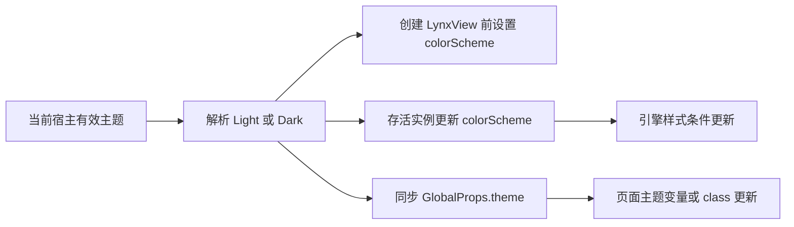

# Lynx 4.0 三端基座接入讨论与实施建议

> 日期：2026-09-11。状态：首批主题与原生诊断接线已实施，运行态验收已完成 iOS 与 Android 模拟器；Harmony 暂无可用设备。
> 用户授权本轮由 iOS、Android、HarmonyOS 三个研发架构 Agent 商讨接入方式。三端完成独立源码核查、主题与诊断契约交叉评审，主 Agent 核查公共模板、编译器默认值和发布脚本并收敛方案。
> 三端架构讨论后已按用户授权实施首批接线；本文件同时保留方案、实施范围和分层验收证据，不把未具备设备条件的平台写成已通过。

## 1. 决策

当前原生引擎和配套依赖已为 4.0.0。本轮接入重点是补齐宿主对新能力的调用与验证：先做三端主题通知及前端基线核对，再做 Android/iOS 原生按需内存诊断。新样式管线采用独立 Bundle 试点；新 sticky 和 XElement 同步注册必须先检查编译器已有行为，不能按原生默认值判断尚未启用。鸿蒙共享元素转场另立工作包，继续保留现有降级。

| 决策 | 具体处理 |
|---|---|
| 原生依赖 | 保持现有 Lynx、PrimJS、Service、XElement 4.0.0，不为本轮引入新版/nightly |
| 宿主主题 | 同一有效宿主主题同时驱动引擎 colorScheme 和页面 GlobalProps.theme |
| 公共 Bridge | 保持现有 Router/Storage/AppInfo 与 callback 语义；主题偏好复用已有 broadcast/GlobalEventEmitter，不新增主题 NativeModule |
| 内存诊断 | Android/iOS 使用官方主动查询；原生按需、低频调用；Harmony 无等价公开主动查询，明确不支持 |
| 编译配置 | 分清引擎默认值、编译器写入值、最终 Bundle 值、运行行为四层证据 |
| OTA | 负责选择和回退完整制品，不新增任意 pageConfig 运行时覆写协议 |
| 撤回方式 | Bundle 配置可随制品回退；宿主代码变更须随 AAR/Pod/HAR 和 App 版本交付或撤回 |
| 当前范围 | 保持三端原生页面模型、单一动画所有者、资源与 OTA Store 的已有职责 |

## 2. 当前基线与重要修正

本次主仓为 `main@2552b623be4d903a80770ff7adbbff62f81f6a4f`，公共模板仓为 `main@090ba99`。主仓相对本机跟踪分支显示落后 2 个提交；本轮未拉取、切换或合并，以当前工作区为事实源。正式实施前重新核对目标提交和用户已有改动。

| 层 | 当前证据 | 结论边界 |
|---|---|---|
| Android | [build.gradle.kts](/Users/nieyutan/Documents/hbc-git/codex/lynx-navigation-to-ota/android/lynx-shell/build.gradle.kts:56) 固定 4.0.0；Agent 检查本机 AAR 包含 Query、Collector、Fetcher | 依赖与 API 静态存在，不代表设备采样已通过 |
| iOS | [Podfile.lock](/Users/nieyutan/Documents/hbc-git/codex/lynx-navigation-to-ota/ios/Podfile.lock:14) 为 4.0.0，安装 Manifest.lock 一致，Pod 源码可读 | 安装事实，不代表当前设备 App 的二进制身份 |
| Harmony | [HAR lock](/Users/nieyutan/Documents/hbc-git/codex/lynx-navigation-to-ota/harmony/lynx_shell_kit/oh-package-lock.json5:9) 和安装包为 4.0.0 | API/依赖事实，未新增设备证明 |
| 基座 Playground | [package.json](/Users/nieyutan/Documents/hbc-git/codex/lynx-navigation-to-ota/playground/package.json:18)：React 0.116.5、Rspeedy 0.13.6、React 插件 0.12.10、types 已更新为 4.0.0；安装的 template 插件 0.10.5 | 与公共模板仍不是同一前端工具链 |
| 公共模板 | [package.json](/Users/nieyutan/Documents/hbc-git/codex/LynxWorkspace/repos/LynxAppPackagesAndTemplates/templates/lynx-template/package.json:31)：types 4.0.0；安装解析 Rspeedy 0.16.3、React 插件 0.18.3、template 插件 0.15.0 | 不能按 semver 声明范围猜安装版本 |

### 2.1 编译器默认值修正

原生 4.0 配置中 `enableNewStylingPipeline`、`enableNewSticky`、`syncXElementRegistry` 默认均为 false；但这不是最终 Bundle 配置。公共模板实际安装的 template 插件在 `sourceContent.config` 中默认写入：

```ts
enableNewSticky: true,
syncXElementRegistry: true,
```

证据：[已安装 LynxTemplatePlugin.js](/Users/nieyutan/Documents/hbc-git/codex/LynxWorkspace/repos/LynxAppPackagesAndTemplates/node_modules/.pnpm/@lynx-js+template-webpack-plugin@0.15.0_tslib@2.8.1/node_modules/@lynx-js/template-webpack-plugin/lib/LynxTemplatePlugin.js:461)。基座 Playground 的 0.10.5 插件未找到这两个默认写入。因此，“业务配置没有显式写开关”不足以推出“所有 Bundle 未启用”。本轮未重新构建或解码已发布 Bundle，不能把插件源码进一步表述成全部在用制品已验证。

后续保留公共模板当前编译器行为；先核对各工具链的有效配置和产物，再决定试点。不为了与引擎默认值一致而强制改成 false，也不再把这两项列为从零接入。

### 2.2 Android 内存中间提交修正

最早 API surface 提交曾有空结果占位；Android Agent 复核最终 4.0.0 标签后确认已经有全局 Collector、TemplateRender 注册/注销及 Fetcher。本机 AAR 也包含相应类。方案采用最终标签与安装产物，撤回“4.0 只有空结果”的中间判断；真实数值和超时行为仍待设备验证。

## 3. 首批工作：三端主题与前端基线

### 3.1 统一语义

原生引擎枚举均为 Light/Dark 两态。宿主负责解析系统主题和其支持的业务覆盖；基座把同一个结果用于初次构建和后续更新。



`theme: 'Light' | 'Dark'` 在 Android/iOS 已存在；Harmony 需要补齐同名字段。文档必须明确它属于宿主保留字段，实施时检查已有 Harmony 页面是否把同名业务字段用于其他含义。主题变化不触发 Bundle reload、主动重建 LynxView、重新导航或 OTA 同步；系统自身触发 Activity 重建时则按现有恢复流程创建新实例。多个活体 LynxView 的显式偏好通过既有 `broadcast`/`GlobalEventEmitter` 同步，避免 Native Tab 的两个页面各自停留在不同偏好。

不宣称仅调用 colorScheme API 就会替硬编码颜色生成深色样式。页面仍需消费主题字段、主题变量或经过编译验证的 CSS 条件；需检查同一页面在两种主题下的真实渲染。

### 3.2 iOS 架构 Agent 建议

最小修改位置：

- [LynxNativeRuntime.h/.m](/Users/nieyutan/Documents/hbc-git/codex/lynx-navigation-to-ota/ios/LynxShellKit/Native/LynxNativeRuntime.m:65)：创建参数传入已解析主题，设置 `builder.colorScheme`。
- [LynxContainerViewController.swift](/Users/nieyutan/Documents/hbc-git/codex/lynx-navigation-to-ota/ios/LynxShellKit/Container/LynxContainerViewController.swift:632)：取容器自身 trait，在颜色外观变化时更新存活 View；覆盖 Native Tab 使用的同一容器路径。
- [ShellGlobalPropsFactory.swift](/Users/nieyutan/Documents/hbc-git/codex/lynx-navigation-to-ota/ios/LynxShellKit/Runtime/ShellGlobalPropsFactory.swift:32)：复用 `theme`，确保与引擎色彩同源。

真实 API：`LynxView.updateColorScheme:`；`LynxColorScheme` 只有 Light=0、Dark=1。初次构建使用容器有效 trait；`traitCollectionDidChange` 中仅颜色外观变化时处理，所有 UIKit/LynxView 操作进入主线程。不要改用全局 Window/Screen 的主题替代容器主题。

保持 Provider、XElement AutoRegistry、首屏 generation、消息与 lease 清理、现有 UIKit 转场仲裁。对 filtered pan 的 release 描述，本轮未核到足以实施的公开 API，列为待确认，不进入首批改动。

### 3.3 Android 架构 Agent 建议

最小修改位置：

- [LynxContainerFactory.kt](/Users/nieyutan/Documents/hbc-git/codex/lynx-navigation-to-ota/android/lynx-shell/src/main/java/com/example/lynxshell/container/LynxContainerFactory.kt:17)：从当前容器 Activity 的有效 Configuration 解析夜间模式，在 build 前设置 `setColorScheme(...)`。
- [LynxShellActivity.kt](/Users/nieyutan/Documents/hbc-git/codex/lynx-navigation-to-ota/android/lynx-shell/src/main/java/com/example/lynxshell/container/LynxShellActivity.kt:449) 与 [LynxTabFragment.kt](/Users/nieyutan/Documents/hbc-git/codex/lynx-navigation-to-ota/android/lynx-shell/src/main/java/com/example/lynxshell/tab/LynxTabFragment.kt:215)：处理配置变化不重建、Tab 再次可见时的幂等同步；常规重建继续走 Factory。
- [ShellGlobalPropsFactory.kt](/Users/nieyutan/Documents/hbc-git/codex/lynx-navigation-to-ota/android/lynx-shell/src/main/java/com/example/lynxshell/runtime/ShellGlobalPropsFactory.kt:45)：复用既有 `theme`。

真实 API：Builder 的 `setColorScheme` 和 View 的 `updateColorScheme`。动态更新必须在 UI 线程；只修 Activity 会漏掉 Fragment/Native Tab。保留 `MOST_ON_TASM`、现有 XElement/R8 注册和 build 后、render 前的 Client 安装。

不为主题新设无需求开关；也不改变 Manifest 的 `configChanges` 策略来逃避恢复验证。完整配置变化由现有宿主生命周期决定，主题同步只处理本端职责。

### 3.4 Harmony 架构 Agent 与主 Agent 收敛建议

本轮沿现有单主 Window 与 Router 所有权接线，不新增多 Window 架构、ThemeController 或第二套页面注册表。

已在 [LynxRouter.ets](/Users/nieyutan/Documents/hbc-git/codex/lynx-navigation-to-ota/harmony/lynx_shell_kit/src/main/ets/routing/LynxRouter.ets:25) 新增窄宿主接口 `setTheme(theme: 'Light' | 'Dark'): void`。当前主题的读取保留在模块内部。复用现有实例管理，把更新交给存活 Page/Tab；具体内部调用维护容器的现有 MetaData 和 Bundle 身份。

外部宿主在 install 后提供初值，在 `UIAbility.onConfigurationUpdate` 中转发有效变化；不能让 HAR 隐式依赖只有 Demo 才写入的 `AppStorage('lynx_color_mode')`。修改范围为 Router、现有实例分发、[LynxContainer.ets](/Users/nieyutan/Documents/hbc-git/codex/lynx-navigation-to-ota/harmony/lynx_shell_kit/src/main/ets/pages/LynxContainer.ets:341)、[LynxTabContainer.ets](/Users/nieyutan/Documents/hbc-git/codex/lynx-navigation-to-ota/harmony/lynx_shell_kit/src/main/ets/pages/LynxTabContainer.ets:305)、[ShellGlobalPropsFactory.ets](/Users/nieyutan/Documents/hbc-git/codex/lynx-navigation-to-ota/harmony/lynx_shell_kit/src/main/ets/common/ShellGlobalPropsFactory.ets:20)，以及宿主示例的明确调用。

关键平台差异：Harmony 系统 `ColorMode` 的 DARK=0、LIGHT=1、NOT_SET=-1；Lynx 是 LIGHT=0、DARK=1，禁止数值透传。4.0 Harmony wrapper 的 `LynxView.colorScheme` 字段保持 private，当前实现于 `onCreate` 回调取得 Context 后立即调用官方 `LynxContext.updateColorScheme` 设定首值；动态变化同样更新 Context，并通过 `updateMetaData` 补齐/更新 GlobalProps.theme，保留业务数据及其他宿主字段。

兼容性建议：NOT_SET/缺失值不直接下发；已有实例保持上次有效主题，首次无值沿用当前 SDK 默认 Light。此处是保持现有行为的建议策略，不表示已推断系统真实主题。业务覆盖、多 Window 的有效主题来源不在本轮自动扩展范围。

### 3.5 前端基线和构建安全

1. Playground 的 types 由 3.7.0 对齐到 4.0.0，先跑既有类型检查，按实际错误修正；不因此批量升级 React/Rspeedy 或修改所有页面。
2. 公共模板保留 `enableNewGesture: true`、现有 UI/Hook 单实例约束。它目前没有显式指定 engineVersion，安装插件默认是 3.2；该值是 Bundle 最低兼容引擎，不能当作原生 SDK 版本。
3. 单独建立 4.0 验证 Bundle，显式 `engineVersion: '4.0'`，在新基座验证主题和目标能力；保留旧 Bundle，验证 4.0 宿主对既有兼容目标的承载。公共模板默认是否统一抬至 4.0，由实际宿主范围及这轮回归结果决定，不把类型升级等同最低引擎目标升级。
4. 不直接运行当前模板的完整 build 作为只读验收：[build.mjs](/Users/nieyutan/Documents/hbc-git/codex/LynxWorkspace/repos/LynxAppPackagesAndTemplates/templates/lynx-template/scripts/build.mjs:104) 会继续调用发布脚本。先复用既有路线图 F02 分离纯构建与发布，再执行不会上传/发布的构建入口。
5. 三端 OTA 试点前复用既有 F03 修订：[write-bundle-list.mjs](/Users/nieyutan/Documents/hbc-git/codex/LynxWorkspace/repos/LynxAppPackagesAndTemplates/templates/lynx-template/scripts/write-bundle-list.mjs:7) 当前只允许 Android/iOS；同 SHA 的平台变化处理也在原有工作包内。不能把原生 Harmony SDK 已安装当作发布链已支持 Harmony。

## 4. 第二批工作：Android/iOS 原生主动内存诊断

Android 使用 `LynxMemoryUsageQuery.inst().queryLynxGlobalMemoryUsageAsync(...)`；iOS 使用 `LynxMemoryUsageQuery.sharedInstance` 的异步查询。先在已有原生调试入口按需调用，不新增通用 JS Bridge、周期轮询或自动清理行为。相关 API 是当前进程内 Lynx 归属内存的快照，不是 JS 堆保留链分析。[官方内存查询文档](https://lynxjs.org/guide/performance/monitor-performance/global-memory-usage-query)

保留 `collectionStatus`、expected/completed 实例数量、耗时和字节信息；TIMEOUT 表示部分结果，不包装成完整成功。遵循 SDK 聚合值，不把所有实例 totalBytes 简单相加，因为共享运行时可能重复计入实例信息。回调线程不等同 UI 线程，展示时回到主线程。调试记录使用受控标识，不写原始 Bundle URL、查询参数或凭证。

Harmony SDK 的性能类型和内存压力通知，不等同 Android/iOS 的主动全局内存查询。当前方案记录“不支持”，不以 0、空数组或 OTA 磁盘统计冒充 Lynx 内存结果。也不为了表面统一新增一套跨端诊断 Bridge。

最小验收：0/1/2 个存活实例、关闭一个实例后排除、查询期间销毁、正常完成、超时部分结果、回调线程。源码/API 存在与真机采集有效分开结项。

## 5. 第三批工作：按制品验证 4.0 编译与样式能力

| 项目 | 核实结果 | 建议 |
|---|---|---|
| enableNewStylingPipeline | 原生默认 false，可读取 native/settings；本次未找到公共模板默认写入 | 仅独立验证 Bundle 试点，不在宿主全局强制开启 |
| enableNewSticky | 原生默认 false；公共模板 0.15.0 编译插件默认写 true | 核对最终产物和既有页面行为，先做回归而非再次接入 |
| syncXElementRegistry | 原生默认 false/export:false；公共模板编译插件默认写 true | 保留现有注册链；export:false 不等于编译器绝不会写入 |
| engineVersion | 公共模板解析默认 3.2 | 新 4.0 验证制品显式声明，旧制品兼容验证单独覆盖 |

原生默认定义：[4.0 配置源码](https://github.com/lynx-family/lynx/blob/4.0.0/core/template_bundle/template_codec/binary_decoder/lynx_config.yml)。最低引擎目标含义：[官方兼容性说明](https://lynxjs.org/guide/compatibility.html)。

编译验证先记录 effective encode config，再检查实际产物和三端运行状态。已安装 TemplatePlugin 提供 `beforeEncode` hook 与 `encodeData.sourceContent.config`；hook 标为 alpha，可作为受控 PoC 的核查入口，不能未经验证就把未知字段塞进 `pluginReactLynx`，也不能编辑 node_modules。当前编译器能否完整编码新样式管线、三端是否按预期采用，仍待隔离编译和运行证明。

每个实验制品只改变一个待验证配置，以相同页面数据对照继承/选择器/动态样式、sticky 滚动、XElement、首屏错误和返回交互。CSS 条件能否生效还取决于页面声明与编译器支持，不以 API 调用返回证明视觉正确。

## 6. 暂缓项与理由

- 鸿蒙共享元素转场：SDK 快照只是已挂载组件的 PixelMap 获取；尚需来源/目标配对、几何和首帧门禁、覆盖层、隐藏恢复、进度与取消、页面栈提交、减少动态效果与资源释放。当前 [getTransitionState](/Users/nieyutan/Documents/hbc-git/codex/lynx-navigation-to-ota/harmony/lynx_shell_kit/src/main/ets/routing/LynxNavigator.ets:460) 继续返回 degraded。只有确定业务转场目标后，先做 API 13 快照 PoC，再单独实施协调器。
- 同步 JSB：Harmony 4.0 的支持不改变现有三端 callback 契约。Router、IO、网络、OTA 不改成同步返回；未来确有纯内存同步方法再逐项评审。
- Autolink：现有显式 NativeModule/Service/XElement 方向继续保留；不以 4.0 release 新增 Autolink 为由重构整个基座。
- filtered pan、RTS 调试和其他专项能力：在已确认具体业务问题、真实公开 API 和可复现目标后单独接入。本轮不把 release 中所有条目强制转成宿主改动。

## 7. 分批交付与验收

| 批次 | 可以并行的所有权 | 完成条件 |
|---|---|---|
| A：主题与基线 | iOS 只改 iOS 模块；Android 只改 Android 模块；Harmony 只改 HAR 及必要宿主接线；前端负责类型与验证 Bundle | 三端初始/动态主题同源，旧页面兼容，原生模块编译通过，真实平台视觉与生命周期证据齐全 |
| B：主动诊断 | Android/iOS 各自原生诊断入口 | 多实例、销毁、超时、线程均有运行证据；Harmony 不支持状态清楚 |
| C：编译配置 | 一个构建入口负责人维护公共模板；三端各自验收同一制品 | 有效配置、产物、运行行为可对应；新旧制品回退可复现 |
| D：鸿蒙转场 | Harmony 独立工作包，复用三端公开转场语义 | 快照 PoC 后再验协调器、手势取消和栈提交；未完成前不撤下 degraded |

首批必验场景：

- 冷启动 Light/Dark、运行切换、隐藏页返回、Native Tab 切换、旋转/系统重建、多 LynxView。
- iOS 容器 override；Android 宿主不重建配置变化；Harmony NOT_SET 与反向枚举映射，外部宿主不写 Demo AppStorage 仍可接入。
- 更新引擎色彩和 GlobalProps 时不丢 initData、业务字段、Bundle 身份和页面 lease，不增加主题引起的网络请求。
- iOS/Android 现有转场的完成和取消、首屏错误、一次性 OTA 恢复保持原有行为。Harmony 保留自身 current/previous 语义，不套用 candidate/trial。
- 类型/静态、JVM/Swift/host 测试、模块构建、Simulator/device、制品发布分别留证；浏览器不能替代任何原生平台验收。

按现有工程命令选择静态检查、Android Library JVM 测试与 Sample 构建、iOS Module/Simulator 构建、Harmony HAR/HAP 构建；实施前复核本机工具与目标设备，不为本轮方案编造已通过结果。OTA 核心未改时不为主题任务重复全套存储故障测试，但要验证容器接线没有触发错误恢复或额外网络。

本方案补充 [既有框架路线图](/Users/nieyutan/Documents/hbc-git/codex/lynx-navigation-to-ota/docs/superpowers/specs/2026-09-08-lynx-framework-roadmap.md) 的宿主、主题和诊断工作；复用其中 F02/F03 的发布前置事项，不把其余长期路线自动纳入此次实施授权。

## 8. 实施结果与证据边界

已完成主题接线、Playground 类型基线，以及 Android/iOS 原生聚合内存查询入口：iOS/Android 容器创建时读取当前宿主主题，运行中通过 Lynx 4.0 color scheme API 与既有 GlobalProps.theme 同步；Harmony 通过 `LynxRouter.setTheme` 接收宿主解析后的两态主题，并更新存活 Context。Playground 的 `@lynx-js/types` 已更新为 4.0.0，lockfile 已重新解析。Android/iOS 的 `LynxRouter.queryMemoryUsage` 只返回状态、实例计数和聚合字节，不暴露 URL/pageId。

已执行并通过：Android `:lynx-shell:testDebugUnitTest`（Gradle 8.14.4 + Android Studio JBR 21，BUILD SUCCESSFUL）、iOS `ios/OtaIOSSDK` Swift 测试（54 tests/9 suites）、Playground `pnpm exec tsc --noEmit`、Playground `pnpm build`、Harmony `assembleHar --mode module`、Android/iOS 静态检查（111 PASS）和 Harmony 静态检查（89 PASS）。一次普通 iOS workspace 构建被当前工作树中 Pods 工程引用的两个缺失 Swift 源文件阻断；在不修改这些无关工程引用、仅用 `EXCLUDED_SOURCE_FILE_NAMES` 排除缺失输入后，LynxShell Simulator Debug 构建成功。针对用户反馈又沿真实 Native Tab 路径构建并安装 Debug App 到 `iPhone 16 Pro / iOS 18.1`：普通 Tab 读取最新 Direct Asset，Home/Settings 两个常驻实例在 Light→Dark→Light 系统切换中保持同源，且实例 `load/resolve/render` 计数不增加；在 Settings 选择显式 Light 后切回 Home，Home 也同步为 Light。代表性截图为 `/tmp/lynx40-tab-direct-final-home-light.png`、`/tmp/lynx40-tab-direct-final-settings-dark.png`、`/tmp/lynx40-tab-shared-preference-home-light.png`。

本轮又启动 `LynxScreens_API35`（Android 15 / API 35，serial `emulator-5554`），安装 `android/app/build/outputs/apk/debug/app-debug.apk`，沿 `MainActivity → NativeTabDemoActivity → LynxTabFragment` 实际路径复测。初始问题的证据是首页加载 OTA current `r20260901_0f1ter`、而设置页是另一份产物；修复后两个 Tab 均显示 `Direct Asset / main.lynx.bundle`。在同一 Activity 内执行系统 Light→Dark→Light 切换，两个 Tab 内容和原生顶栏、底部 TabBar 均同步，内容没有空白；在设置页选择显式 Light 后切回首页也保持 Light。代表性截图为 `/tmp/lynx-android-home-light-after-fix-20260911.png`、`/tmp/lynx-android-native-tab-dark-transition-sync-20260911.png`、`/tmp/lynx-android-native-tab-light-transition-sync-20260911.png`。Android 仍未做真机、CI、上传或生产验证；Harmony `hdc list targets` 仍为空。

Harmony 构建工具曾把用户的 `BuildProfile.ets` 恢复为仓库版本；发现后已恢复原有 `BUILD_MODE_NAME='release'`、`DEBUG=false` 改动，其余用户 dirty/untracked 文件未处理。后续构建前后应继续校验该文件。

官方入口：[Lynx 4.0.0 发布说明](https://github.com/lynx-family/lynx/releases/tag/4.0.0)、[主题通知与 GlobalProps](https://lynxjs.org/guide/styling/custom-theming)、[动态色彩 API 提交](https://github.com/lynx-family/lynx/commit/5caebfeafb82858ec8c9daf76665b3d2d4d424f3)、[鸿蒙快照 API 提交](https://github.com/lynx-family/lynx/commit/b3523efb37e27d1a636b0887ee41d0964fbc1cc2)。具体 API 以最终 4.0.0 标签和当前安装产物复核。
