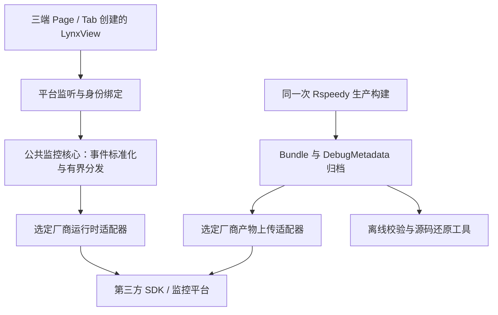

# LynxView 可插拔性能与 JS 异常监控：研发方案 v1.0

状态：G1 三端核心设备运行态验收已完成；真实 Resource/JS Error 回调需要专项测试 Bundle，G2 第三方适配未接入。

核对日期：2026-09-15。代码事实基线：正式 `main@e9ff9ee299d9cd786ad532a46f99a48988ab68ed`，已合入 PR #9 的 Lynx 4.1 升级。

本方案从零设计，不读取、迁移或继承历史 telemetry worktree 的代码、契约和方案。当前分支已经把方案接入正式 4.1 基座，具体实现和验证边界见 implementation.md。

## 1. 产品目标与交付物

对基座承载的每一个 LynxView，采集真实加载、渲染和运行期 JS 异常；记录实际运行的 Bundle 身份；将事件和配套构建产物交给可替换的第三方监控适配器。

最终使用效果：在选定第三方平台按 Bundle、版本、平台查看性能及异常；从一条异常查到对应 View、构建和源码位置。

交付分为两个完成关口：

| 关口 | 交付 | 完成标准 |
|---|---|---|
| G1：公共能力可用 | 三端公共采集、统一事件、SDK 插口、构建归档插口、离线 JS 反解与验收 Sample | Page/Tab 的真实事件进入本地验收适配器；真实构建的主线程与后台错误能离线还原；换验收适配器不改公共层 |
| G2：选定平台可用 | 该厂商的三端适配、调试产物上传、平台配置与查询说明 | 事件真实进入厂商平台；可按 Bundle 构建筛选、比较，实际错误定位到对应源码 |

G1 不是线上大盘验收。厂商未选定不阻塞 G1，但 G2 必须验证厂商的性能、异常、逐事件维度、Lynx 反解及各端支持，不能由一个空接口或上传回执代替。

文档入口：

- [G1 实现与验证说明](implementation.md)
- [运行时事件与适配器契约](runtime-contract.md)
- [构建归档与源码还原契约](build-and-symbolication.md)
- [研发任务与验收矩阵](delivery-plan.md)
- [事件 JSON Schema](event.schema.json) / [构建清单 JSON Schema](artifact-manifest.schema.json)

JSON Schema 与示例用于冻结研发契约；示例不是 SDK 日志或实际构建产物。文件内容哈希、字节数及各字段间的关联，仍需后续工具按语义校验。

## 2. 范围

### 2.1 v1 必做

- Android Activity / Native Tab、iOS Page / Native Tab、HarmonyOS Page / Native Tab 的统一观测。
- 创建、加载、首次内容、可见/隐藏、后台、重试/重载、销毁；生命周期必须来自原生事实。
- SDK 提供的 LoadBundle、ReloadBundle、Pipeline、LazyBundle 性能事件；提取已存在且有效的指标。
- 运行期后台 JS、主线程脚本错误的原始堆栈、结构化帧、错误码、定位类型和调试标识。
- Bundle 发布身份、实际内容 SHA-256、构建调试标识的关联。
- 平台 SDK 可替换；公共层不引入任何厂商依赖或上报域名。
- 每次构建的 debug metadata 归档、校验、可插拔上传和离线双路径反解。
- 指标缺失、事件无法准确归属、适配器拒绝、调试材料缺失均有可查询状态。

### 2.2 独立能力探测任务

内存、长任务、流畅度属于性能目标，必须在研发前期逐端探测并形成证据，不直接画成已经可用的三端统一指标。

- Android/iOS：核对官方全局 Lynx 内存查询的实例快照、共享 runtime 去重、超时和开销；只设计低频主动诊断。
- HarmonyOS：核对是否有等价的实例级内存接口；没有证据则标记 `unsupported`，不上传 App 总内存充当 View 内存。
- 长任务/流畅度：分别核对锁定 SDK 的开关、事件、线程归属和帧统计区间；仅有方法名称不算可用。探测通过后以单独指标契约扩展，不把 Pipeline 耗时当掉帧率。
- Trace：提供测试场景、录制配置与分析步骤。只能分析实际录制的数据；v1 不默认在线上持续录制或上传完整 Trace。

### 2.3 排除

- 订单、商品、支付、按钮点击、转化率等业务埋点。
- 强制为业务组件添加 ActualFMP 或 Timing Flag。已由 Bundle 提供的标记可原样接收。
- 使用用户的 OTA Server/Admin 存储或展示监控。
- 提前实现 ARMS、Bugly 等厂商 SDK；目前只定义选型与适配验收要求。
- 自建监控服务、数据库、告警平台、生产数据大盘 UI。
- 用 Source Map 处理 Java/Kotlin、Swift/Objective-C、C++ 或 ArkTS 原生崩溃符号。
- 把被业务捕获且未报告的错误、所有历史 Promise 异步调用链承诺为可自动恢复。

## 3. 总体结构

### 3.1 模块责任

| 模块 | 责任 | 不承担 |
|---|---|---|
| 原生接线 | 尽早监听 SDK，采集原生生命周期，捕获本次加载身份 | 网络上报、统计分位数、业务 ready 判定 |
| 公共监控核心 | 生成事件 ID，冻结身份，指标提取，字段处理，有限内存分发，接入状态诊断 | 厂商 SDK 类型、HTTP、持久化 outbox、无限重试 |
| 运行时适配器 | 声明实际能力，将事件转换并交给已初始化的厂商 SDK | 修改公共指标定义、读取可变 OTA current、用全局 Bundle 标签覆盖别的 View |
| 构建工具 | 清理前获取 DebugMetadata，完成构建后校验 Bundle 哈希与映射索引并归档 | 把源码/调试材料混进 App 资源或公开 Bundle CDN |
| 产物上传适配器 | 按厂商要求上传、建立查询键并返回真实回执 | 把普通 source-map 支持声明成主线程字节码还原支持 |
| 离线反解工具 | 不依赖厂商服务，证明指定构建的原始定位能够回到源码 | 常驻服务、替代生产平台完整符号化验收 |

公共协议只描述事实，三端分别使用 Kotlin、Swift、ArkTS 类型实现；不为共享几种结构引入 KMP 或新的跨端运行时。

### 3.2 包装与依赖决定

- 公共监控源码放在现有 Android `lynx-shell`、iOS `LynxShellKit`、HarmonyOS `lynx_shell_kit` 的 `monitoring` 目录。
- 保持当前基础模块接入方式；iOS 公共能力不新增第二个必需 Pod。
- 厂商适配独立交付在 `integration/monitoring/<provider>/`，选型后才决定对应 Gradle 模块、Pod 或 HAR；未选择的厂商不得进入依赖图。
- 首版每个进程配置一个运行时适配器，可同时承接性能与 JS 异常；不做多平台广播。厂商能力不足时不隐式发送到第二家。
- 本地 `DiagnosticProvider` 是 G1 验收工具，明确标记 `local_only`；生产未配置 Provider 时监控关闭并暴露状态，不返回上传成功。
- 切换厂商通过初始化配置和重新构建/启动完成，首版不支持活体 View 期间热切换 Provider。

## 4. 正式基座的接入点

以下是现行基座接线事实，不是旧监控方案。研发应从上述 main 基线新建分支。

| 平台 | 性能通道 | 页面覆盖与接线 |
|---|---|---|
| Android | `LynxViewClientV2.onPerformanceEvent`，通过 `addLynxViewClientV2` / `removeLynxViewClientV2` 管理 | 在 `LynxContainerFactory.create` 统一挂载；`LynxShellActivity` 与 `LynxTabFragment` 分别交付身份和可见性 |
| iOS | `LynxViewLifecycleV2` / `LynxPerformanceObserverProtocol`，通过 `addLifecycleClient` 管理 | `LynxNativeRuntime.makeView` 负责共同创建；Page VC 与 `LynxShell.swift` 内独立 Tab VC 分别补齐绑定、刷新和释放 |
| HarmonyOS | 公共 `ShellLynxViewClient.onPerformanceEvent` | `LynxContainer` 和 `LynxTabContainer` 都必须接线，不能只修改普通 Page |

错误沿现有 SDK 错误回调接入独立观测处理；Android V1 错误通道与 V2 性能通道并存。监听不能替换或提前返回现有错误处理，不能因为采集到首屏后的资源/JS 错误就主动回滚或销毁页面。

监听时间要求：View 创建后首次 load/render 前完成 per-view 绑定；创建早期已经错过的 SDK init 事件不得补造，容器创建耗时用单独标明来源的原生计时记录。

## 5. Bundle 身份决定

### 5.1 三类不同的身份

1. 发布身份：`lynxAppId`、`bundleName`、`releaseId`、`releaseSequence`，回答“哪个应用的哪次发布”。
2. 内容身份：实际加载 Bundle 字节的 `sha256`，回答“当前 View 实际用了哪份内容”。
3. 脚本调试身份：堆栈 frame 的 `debugmetadata:<key>` 与 metadata 中各 artifact 的 `source-map.key`，回答“用哪份脚本映射”。

一次 Release 可以包含多个 Bundle；同一 Bundle 内容可在多个 Release 复用；一个 Bundle 内多个脚本可能各有不同调试 key。三者不能互相替代。

### 5.2 身份来源

| 来源 | 事实来源 | 研发动作 |
|---|---|---|
| OTA | 已完成校验并交付本次 View 的 prepare/lease 结果 | 原生交付时生成不可变身份；不能上报时查询 current |
| 登记的内置资源 | 已校验的内置清单和对应字节 | 同步取发布字段与哈希；不能拿同名其他文件的描述 |
| 未登记本地/直连 HTTPS | 当前实际读取的字节 | 复用读取过程在后台计算一次哈希；发布版本无来源则为 null，不按文件名猜版本 |
| 读取失败 | 尝试加载的逻辑名称/来源 | `sha256=null`，记录 unavailable；若有预期哈希，只放失败详情，不冒充实际内容哈希 |

Android `PreparedActivityBundle` 与 Harmony `PreparedPageBundle` 已有 release/hash；iOS 底层 lease 有 `bundle.bundleSha256`，需将其向容器交付。iOS embedded/direct 场景必须另取对应描述或字节，不能假定一定有 downloaded lease。

文件哈希格式统一为 64 位小写十六进制；输入的 `sha256:` 前缀在边界去除。`releaseSequence` 按十进制字符串保存，不转换成浮点数。缺失版本与哈希不补 `latest`、空字符串或全零。

## 6. 指标口径

| 公共名称 | 采集依据 | 单位与解释 |
|---|---|---|
| `lynx_fcp_ms` | LoadBundleEntry 的 `lynxFcp.duration` | ms；执行 Bundle 开始到首次渲染完成 |
| `prepare_to_fcp_ms` | 同事件 `fcp.duration` | ms；准备 Bundle 到首次渲染完成，依赖真实 extraTiming |
| `open_to_fcp_ms` | 同事件 `totalFcp.duration` | ms；原生打开到首次渲染完成，依赖真实 extraTiming |
| `bundle_prepare_ms` | 原生 Provider/prepare 的单调时钟区间 | ms；仅本次获取 Bundle 的准备过程，与引擎 load 分开 |
| `parse_ms` | `parseEnd - parseStart` | ms；模板解析 |
| `bts_load_ms` | `loadBackgroundEnd - loadBackgroundStart` | ms；后台脚本加载执行 |
| `mts_render_ms` | `mtsRenderEnd - mtsRenderStart` | ms；主线程脚本构建元素树 |
| `style_resolve_ms` | `resolveEnd - resolveStart` | ms；样式计算 |
| `layout_ms` | `layoutEnd - layoutStart` | ms；布局 |
| `paint_ui_ops_ms` | `paintingUiOperationExecuteEnd - paintingUiOperationExecuteStart` | ms；绘制相关 UI 操作，不等于全部 GPU 耗时 |
| `pipeline_ms` | `pipelineEnd - pipelineStart` | ms；该条渲染流水线 |

规范：

- 有字段并通过数值/起止校验才输出；缺失、负哨兵或无效值加入 missing/invalidFields，不输出 0。
- 首次加载与重载通过 `loadKind` / SDK entry name 区分；ReloadBundle 的可用字段先由 R0 探测锁定，禁止机械套用首屏结构。
- 旧 `MetricFcpEntry` 仅保留兼容事件来源；同一 load 的同一 FCP 主样本优先使用 LoadBundle/ReloadBundle，不能双计。
- 阶段可跨线程重叠，阶段耗时不能简单相加冒充总耗时。
- `onLoadSuccess`、`onFirstScreen` 的回调到达时刻不能冒充 SDK 的 paintEnd/FCP。原生自己的计时必须标明来源。
- SDK epoch timestamp 和原生 monotonic clock 不直接相减；原生测区间用同一时钟，extraTiming 按官方要求提供，缺失则不展示宿主扩展 FCP。
- Pipeline 默认只保证引擎实际报告的事件，不宣称所有 setState 都被逐次捕获。业务已有 Timing Flag 可以接收；v1 不强制业务标记 ActualFMP。

## 7. 第三方大盘的能力要求

本仓库交付字段和接入配置，实际图表由最终第三方平台承接。选型前不承诺任意 SDK 都能提供下表全部功能。

| 面板 | 最少字段与查询能力 |
|---|---|
| 性能 | 同一指标口径的 P50/P95、有效样本数、覆盖率；按平台、Bundle、构建/发布、宿主版本过滤 |
| 加载健康 | 每个 load 的开始、首次内容、失败、取消、不完整状态；成功率与取消分开 |
| 版本对比 | 相同平台、指标口径、采样策略下比较两个 Bundle 构建；数量不足明确标记 |
| View 详情 | 用 viewId 串起生命周期、loadId、性能、资源及 JS 异常 |
| JS 问题 | 异常次数与影响 View 数分别统计；分组后可看原始事件和各版本 |
| 源码还原 | 对应 frame 的原始位置、映射状态、构建、源码文件/行列与上下文 |
| 数据质量 | 未采集、被采样、字段缺失、无法归属、适配器拒绝、映射失败分别表达 |

加载成功样本以真正首次内容信号/FCP 事实确认；只有 onLoadSuccess 时标记 loaded_unconfirmed。取消不并入渲染失败率；异常次数不作为异常 View 数。首版未配置看门狗不报告“超时率”；未到首屏即销毁的样本标记取消/不完整。

平台必须支持每事件携带 Bundle 上下文，或提供等价隔离 scope。只支持进程全局版本标签且无法正确区分并存 Bundle 的平台，不满足 G2。

## 8. 开发顺序

1. R0：三端实际 API/数据探测和一份生产构建调试材料检查，确定能力表。
2. R1：实现本文及 runtime-contract 的公共模型与原生身份绑定。
3. R2：并行实现 Android/iOS/Harmony Page+Tab 采集、指标映射与本地验收适配器。
4. R3：实现构建归档、离线映射、厂商上传接口和 CI 校验。
5. R4：完成三端 G1 验收及适配器替换测试，发布公共接入说明。
6. R5：选定第三方后实现对应运行时/构建适配，完成真实 G2 大盘与符号化验收。

详细任务、依赖、文件所有权和逐项用例见 [研发清单](delivery-plan.md)。2026-09-15 已完成 Android API 35、iOS 27.0 Simulator、HarmonyOS API 24 的 Page/Native Tab、Performance、Provider snapshot 和 crash marker 验收；Resource/JS Error 真实回调、厂商上传和生产部署仍未执行。

完整结果见 [G1 三端验收报告](g1-acceptance-report-2026-09-15.md) 与 [G1 执行记录](g1-execution-log-2026-09-15.md)。

## 9. 官方依据与版本处理

- [监控性能总览](https://lynxjs.org/zh/guide/performance/monitor-performance.md)：事件采集与上报分析边界。
- [分析性能](https://lynxjs.org/zh/guide/performance/analysis-performance.md)：Trace、渲染、框架、内存、流畅度分析。
- [Performance API](https://lynxjs.org/zh/guide/performance/monitor-performance/performance-api.md)：各端接收、回调乱序、Reload 与隐藏 View 的事件边界。
- [LoadBundleEntry](https://lynxjs.org/zh/api/lynx-api/performance-api/performance-entry/load-bundle-entry.md)：阶段字段和 FCP 起点。
- [MetricFcpEntry](https://lynxjs.org/zh/api/lynx-api/performance-api/performance-entry/metric-fcp-entry.md)：3.7 起废弃，迁移到 LoadBundle/ReloadBundle。
- [全局 Lynx 内存查询](https://lynxjs.org/zh/guide/performance/monitor-performance/global-memory-usage-query.md)：主动诊断、实例归因、共享 runtime 与超时。
- [线上错误反解](https://lynxjs.org/zh/rspeedy/map-errors-to-source.md)：DebugMetadata、per-artifact key、生产清理与主线程双阶段映射。

页面可能继续更新；研发以锁定 Engine 4.1.0 / PrimJS 4.1.1 / Rspeedy 0.17.0 / React 插件 0.20.0 的实际公开 API 和可复现产物为准。网页示例、包内字段名不一致时，在 R0 映射表记录，不为迁就示例升级依赖。
