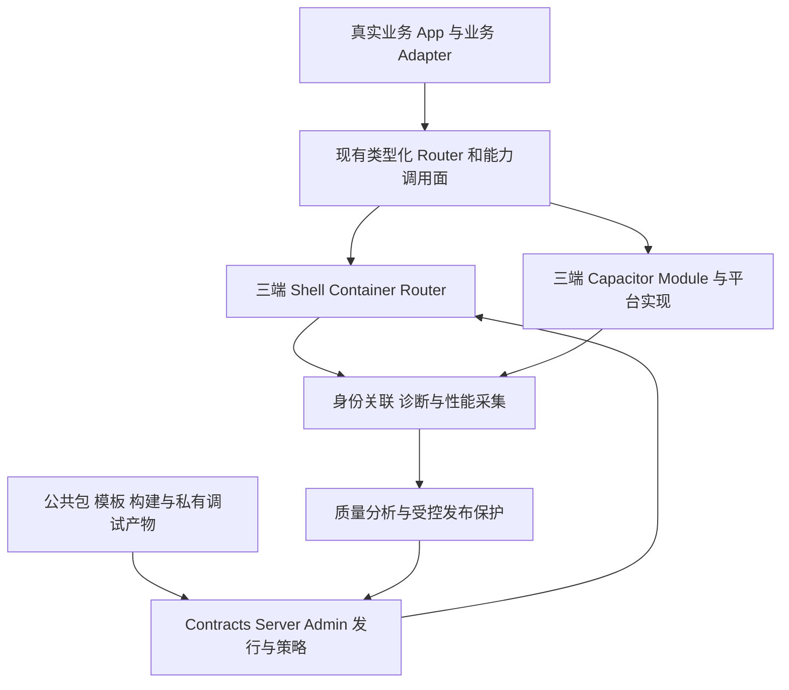

# Lynx 三端框架完善路线与验收规格

> 日期：2026-09-08。状态：供本次讨论审阅的建设建议；尚未批准为全部实施范围。本文记录本轮当前源码/依赖复核，不代表构建、设备或线上验收已通过。
> 本轮不修改运行代码、不切换或合并分支、不发包、不发布、不部署。后续按任务范围实施并分别提供证据。

## 1. 明确下一步

先完成 M0 的正式交付基线，再完成 M1 的一个真实业务闭环；M2 提供运行诊断与发布保护；M3 提供规模化维护、性能体验与持续验收。不要同时启动所有工作包。

建议立刻启动的顺序：F00 确认正式集成基线 → F01 对齐 Contracts 正式包 → F02 分开构建/发布 → F03 三端发行语义 → F04 服务端验证门禁 → F05 干净目录消费。F00/F01治理与F02脚本工作可并行；F03/F04可在契约明确后并行。

当前单独增加原生插件、重新设计 canIUse、引入 Sparkling autolink 或重建 OTA 平台，均不是首轮目标。Native能力继续以当前手写Module为正式方向。

## 2. 当前事实与上一版结论修正

| 项目 | 当前确认事实 | 对计划的影响 |
|---|---|---|
| 当前打开主仓 | main@2552b623；三端能力源码已经 tracked，但默认宿主只注册 Shell Module | 不能用源码目录存在证明正式宿主已接入 |
| 能力工作树 | codex/capacitor-lynx-module@171e9801；三端依赖/注册/销毁已接线 | 作为能力集成事实源，先决定交付范围，不重做已有功能 |
| 原生能力探测 | 已有 getCapabilityStatus 等JS/Native接口 | 完善状态语义、方法矩阵和实际调用，撤回“从零建设能力探测”的建议 |
| 能力状态差异 | Android/iOS含methods/implementedMethods/platform；Harmony当前name/state/reason；native与implemented用词不同 | 统一现有契约；权限与历史设备验收分别表示 |
| 旁仓 NativeBridge/HostSdk | Sparkling契约与双端Owner聚合，含fallback；不是当前手写三端主链 | 保留既有职责，不把其目录数当三端功能完成度 |
| Contracts | test@322e778a，源码仍0.1.1但有minor changeset；Server/Admin已安装0.1.1缺新helper/DTO | 必须补正式包、consumer lock和隔离消费证明 |
| OTA Server/Admin | test@aa10d1ae / test@364e4a9a；已有灰度、版本门禁、审计、指标和手动告警 | 继续复用，重点补真实validate、诊断和持续保护 |
| 构建模板 | main@090ba99；harmony不被允许；same-SHA会跳过平台变化；build可能触发外部写入 | F02/F03必须一起处理，不能只加一个enum |
| 正式仓库拓扑 | CLI/manifest仍选择旧Sdk/Template；新合并仓与旧仓同时存在且旧仓有dirty | 先确认维护归属，不直接删除旧仓或猜remote |
| 业务迁移抽样 | Travel Main匿名session、请求deferred、改名页mock query/intent | 原生能力实现不等于业务接通；首批可选这条链验证框架 |

### 2.1 核心证据

- 主仓Android仅Shell注册：[android/lynx-shell/src/main/java/com/example/lynxshell/runtime/LynxRuntimeInitializer.kt:45](/Users/nieyutan/Documents/hbc-git/codex/lynx-navigation-to-ota/android/lynx-shell/src/main/java/com/example/lynxshell/runtime/LynxRuntimeInitializer.kt:45)。
- 能力工作树Android注册：[android/lynx-shell/src/main/java/com/example/lynxshell/runtime/LynxRuntimeInitializer.kt:49](/Users/nieyutan/Documents/hbc-git/codex/lynx-capacitor-module/android/lynx-shell/src/main/java/com/example/lynxshell/runtime/LynxRuntimeInitializer.kt:49)；iOS：[ios/LynxShellKit/Native/LynxNativeRuntime.m:61](/Users/nieyutan/Documents/hbc-git/codex/lynx-capacitor-module/ios/LynxShellKit/Native/LynxNativeRuntime.m:61)；Harmony：[harmony/lynx_shell_kit/src/main/ets/pages/LynxContainer.ets:91](/Users/nieyutan/Documents/hbc-git/codex/lynx-capacitor-module/harmony/lynx_shell_kit/src/main/ets/pages/LynxContainer.ets:91)。
- 已有JS能力调用：[playground/src/lib/lynxNativeModule.ts:52](/Users/nieyutan/Documents/hbc-git/codex/lynx-capacitor-module/playground/src/lib/lynxNativeModule.ts:52)；Harmony入口gate：[harmony/lynx_capacitor_kit/src/main/ets/module/LynxCapacitorModule.ets:679](/Users/nieyutan/Documents/hbc-git/codex/lynx-capacitor-module/harmony/lynx_capacitor_kit/src/main/ets/module/LynxCapacitorModule.ets:679)。
- Contracts changeset：[.changeset/ota-user-gray-versioncode.md:1](/Users/nieyutan/Documents/hbc-git/codex/LynxWorkspace/repos/LynxContracts/.changeset/ota-user-gray-versioncode.md:1)；Server消费：[package.json:30](/Users/nieyutan/Documents/hbc-git/codex/LynxWorkspace/repos/LynxOtaServer/package.json:30)。
- 模板平台限制：[templates/lynx-template/scripts/write-bundle-list.mjs:7](/Users/nieyutan/Documents/hbc-git/codex/LynxWorkspace/repos/LynxAppPackagesAndTemplates/templates/lynx-template/scripts/write-bundle-list.mjs:7)；同字节跳过：[templates/lynx-template/scripts/publish-release.mjs:167](/Users/nieyutan/Documents/hbc-git/codex/LynxWorkspace/repos/LynxAppPackagesAndTemplates/templates/lynx-template/scripts/publish-release.mjs:167)。
- Server当前validate：[src/storage/prisma.ts:1526](/Users/nieyutan/Documents/hbc-git/codex/LynxWorkspace/repos/LynxOtaServer/src/storage/prisma.ts:1526)；publishInternal：[src/modules/release/service.ts:328](/Users/nieyutan/Documents/hbc-git/codex/LynxWorkspace/repos/LynxOtaServer/src/modules/release/service.ts:328)。
- 真实业务接入缺口：[apps/lynx-capp-travel-main/src/app/runtime.ts:29](/Users/nieyutan/Documents/hbc-git/codex/LynxWorkspace/repos/LynxCappMigrations/apps/lynx-capp-travel-main/src/app/runtime.ts:29)；[apps/lynx-capp-travel-main/src/pages/trip/trip-edit/TripEditPage.tsx:21](/Users/nieyutan/Documents/hbc-git/codex/LynxWorkspace/repos/LynxCappMigrations/apps/lynx-capp-travel-main/src/pages/trip/trip-edit/TripEditPage.tsx:21)。

这些结论不判断历史分支安排的对错。独立Module先合入、宿主后集成可能是有意拆分；本方案要求的是正式交付时有唯一可复现组合。

## 3. 完整框架的职责分层

| 层 | 负责 | 不承担 | 本轮对应工作 |
|---|---|---|---|
| 宿主运行 | Lynx初始化、容器、前后台、窗口、安全区、原生模块装配 | CAPP接口与业务状态机 | F00、A04 |
| Router | 页面身份、Native Page Stack、结果、消息、转场 | 登录真实性与业务数据 | A01、A04、A05 |
| Native能力 | 权限、平台API、任务归属、事件、取消、结果 | 目录存在即代表设备可用 | A02、A06、A07 |
| 业务组合根 | 账号、鉴权、业务HTTP、会话事件、业务缓存 | 通用SDK替业务编造默认成功 | A03、A05 |
| UI | 高复用交互、主题、列表/表单/状态与可访问性 | 后端调用、支付/登录策略 | U01 |
| 资源 | 图片/字体/文件的来源、缓存、失效与离线等级 | 再造一套OTA Bundle Store | U02 |
| 构建/依赖 | 确定的包、入口、产物、hash和调试信息 | 默认构建偷偷等同发布 | F01、F02、F03、F05、O02 |
| 发行 | 真实验证、兼容筛选、签名、灰度、恢复和审计 | 用文件后缀证明可运行 | F04、S01、O04、R01 |
| 诊断 | 客观记录、脱敏、采样、可靠交付与聚合 | 改写Router/OTA成功与失败 | O01、O02、O03 |
| 质量 | 跨端行为、旧新版本兼容、性能、设备证据 | 静态PASS代替真机 | Q01、Q02 |
| 开发者入口 | 干净安装、示例、诊断、真实命令与版本 | 多个冲突的默认入口 | F00、F05、D01 |

## 4. 四个里程碑与完成条件

| 里程碑 | 任务 | 可以开始下一阶段的证据 |
|---|---|---|
| M0 正式交付能复现 | F00—F05 | 干净检出/安装→三端已集成宿主→合法制品→不可绕过发布校验；同SHA新增Harmony用例通过 |
| M1 真实业务可使用 | A01—A07 | 宿主真实会话→业务请求→原生导航→提交→返回刷新；多页事件与任务不串页；三端设备证据 |
| M2 出问题可发现与恢复 | O01—O04、S01 | 事件有真实身份与分母、错误可还原/明确未还原、发行可信、持续评估可暂停扩大并恢复 |
| M3 团队能长期维护 | Q01/Q02/U01/U02/D01/R01 | 发布门禁持续执行、性能预算与运行基线、核心组件、资源与运维文档可被他人复现 |

阶段顺序表示依赖，不是承诺工期。F00核实分支整合范围和正式包获取方式之后才能估算工时；业务会话/设备/环境可能成为实施依赖。本次没有把这些未知值当作已满足。

## 5. 工作包索引

| ID | 阶段 | 工作包 | 责任角色 |
|---|---|---|---|
| F00 | M0 | 收口正式源码、宿主集成和仓库入口 | 框架维护者 + 三端宿主维护者 |
| F01 | M0 | 正式 Contracts 包与 Server/Admin 消费版本对齐 | Contracts + Server/Admin 维护者 |
| F02 | M0 | 分开纯本地构建和外部发布，并先校验后上传 | 模板构建发布维护者 |
| F03 | M0 | 补齐 Harmony 与发布元数据变化判定 | 模板 + OTA 契约维护者 |
| F04 | M0 | 真实产物校验与不可绕过的发布门禁 | OTA Server，Admin/模板消费校验结果 |
| F05 | M0 | 真实 tgz 消费、独立模板与统一验证入口 | 公共包与模板维护者 |
| A01 | M1 | 形成当前手写 Module 的稳定业务调用面 | 前端接入维护者 + 原生维护者 |
| A02 | M1 | 统一已有能力状态契约并形成方法级兼容矩阵 | Capacitor 三端实现 + 业务调用面维护者 |
| A03 | M1 | 接通宿主会话、请求与账号切换 | 业务 App + 宿主业务 Adapter；HTTP 核心保持精简 |
| A06 | M1 | 修齐能力目录与Native事件订阅入口 | Harmony能力维护者 + 三端事件契约维护者 |
| A07 | M1 | 多LynxView事件归属、长任务与终态 | 三端能力runtime + JS transport维护者 |
| A04 | M1 | 页面生命周期、事件和任务清理的三端一致性 | Router/Container + 能力异步任务维护者 |
| A05 | M1 | 完成一个现有业务闭环并以其作为接入样板 | 业务开发 + 框架维护者 |
| O01 | M2 | 建立统一诊断事件与页面尝试口径 | 观测包 + 三端采集 + Contracts/Server |
| O02 | M2 | 先证明 Lynx 源码映射，再建设异常还原 | 构建工具 + 原生调试 + 诊断后端 |
| O03 | M2 | 观测可靠交付与数据质量看板 | 观测维护者 + 服务端运维 |
| O04 | M2 | 持续质量评估、暂停扩大灰度和人工恢复 | Server策略/告警 + Admin发布界面 |
| S01 | M2 | 发行签名、代码来源与兼容恢复 | Server发行 + 三端OTA |
| Q01 | M3 | 三端行为一致性与设备发布门禁 | 三端维护者 + QA + CI维护者 |
| Q02 | M3 | 性能、内存与资源预算 | 三端性能 + 页面开发 |
| U01 | M3 | 形成高频业务UI与三端交互规范 | UI包维护者 + 业务设计/开发 |
| U02 | M3 | 资源、缓存与离线体验闭环 | 模板资源构建 + Provider + 业务缓存 |
| D01 | M3 | 开发诊断入口和可复现接入文档 | 框架维护者 + 开发体验维护者 |
| R01 | M3 | 形成发布运维、恢复与支持边界 | 框架发布 + Server运维 + 业务owner |

## 6. 可分派工作包

每张卡均为建议范围，验收项是未来必须执行的检查，不是本轮测试结果。引用的主仓/能力工作树先按F00选择正式入口，再实施对应文件。

### F00 收口正式源码、宿主集成和仓库入口

**阶段：** M0。**现状：** 已确认交付基线分叉。
**负责人角色：** 框架维护者 + 三端宿主维护者。
**依赖：** 无；其余任务可以准备，但正式交付依赖本项。

**入口文件：**
- [README.md](/Users/nieyutan/Documents/hbc-git/codex/lynx-navigation-to-ota/README.md)
- [android/settings.gradle.kts](/Users/nieyutan/Documents/hbc-git/codex/lynx-capacitor-module/android/settings.gradle.kts)
- [ios/LynxShellKit.podspec](/Users/nieyutan/Documents/hbc-git/codex/lynx-capacitor-module/ios/LynxShellKit.podspec)
- [harmony/lynx_shell_kit/src/main/ets/pages/LynxContainer.ets](/Users/nieyutan/Documents/hbc-git/codex/lynx-capacitor-module/harmony/lynx_shell_kit/src/main/ets/pages/LynxContainer.ets)
- [repo-manifest.json](/Users/nieyutan/Documents/hbc-git/codex/LynxWorkspace/repo-manifest.json)
- [bin/lynx-workspace](/Users/nieyutan/Documents/hbc-git/codex/LynxWorkspace/bin/lynx-workspace)

**执行步骤：**
- [ ] 记录主仓 main@2552b623、能力工作树 codex/capacitor-lynx-module@171e9801 的受控差异，区分 Module 源码、宿主依赖、注册、销毁、Sample 入口和本机 BuildProfile。
- [ ] 明确交付分支采用哪些已实现提交；保留当前 manual LynxModule 注册方式。先形成可审阅差异与三端验收清单，合并/提交/发布按用户授权执行。
- [ ] 确认合并包模板仓与旧 LynxSdk/LynxAppTemplate 的正式维护归属；未迁出的 examples/SDK 明确保留位置。确认真实远端后再修改 manifest，不猜 remoteSlug。
- [ ] 让 CLI clone、sync、install 消费同一份仓库清单快照；更新角色下载验证与文档，保护已有 dirty 工作。

**交付物：** 一份正式源码/分支/包版本/宿主产物对应表；一套三端均注册 Router + 原生能力的交付入口。

**完成标准：**
- [ ] 从干净目录获取同一版本，三端普通页面与 Native Tab 页面均能查询 LynxCapacitorModule 并执行真实原生方法。
- [ ] 切换 Tab、关闭普通页、关闭 Tab 容器分别验证对应清理入口；场景中保留的其他页面仍可调用。模块存在、宿主已注册、设备调用成功分别留证。
- [ ] template 角色的 init/add/sync 得到同一仓库集合；旧仓保留项和退出条件写清。

**范围约束：** 本项整合已有实现，不扩展插件数量、不切换 Sparkling/autolink、不删除旧仓。

### F01 正式 Contracts 包与 Server/Admin 消费版本对齐

**阶段：** M0。**现状：** 源码与已安装 npm 0.1.1 不一致。
**负责人角色：** Contracts + Server/Admin 维护者。
**依赖：** F00 确认版本与交付源；预发布 tarball 验证可以独立先做。

**入口文件：**
- [packages/shared/package.json](/Users/nieyutan/Documents/hbc-git/codex/LynxWorkspace/repos/LynxContracts/packages/shared/package.json)
- [.changeset/ota-user-gray-versioncode.md](/Users/nieyutan/Documents/hbc-git/codex/LynxWorkspace/repos/LynxContracts/.changeset/ota-user-gray-versioncode.md)
- [package.json](/Users/nieyutan/Documents/hbc-git/codex/LynxWorkspace/repos/LynxOtaServer/package.json)
- [package.json](/Users/nieyutan/Documents/hbc-git/codex/LynxWorkspace/repos/LynxOtaAdmin/package.json)
- [scripts/verify-local-contracts.mjs](/Users/nieyutan/Documents/hbc-git/codex/LynxWorkspace/repos/LynxOtaServer/scripts/verify-local-contracts.mjs)
- [scripts/verify-persistence-readiness.mjs](/Users/nieyutan/Documents/hbc-git/codex/LynxWorkspace/repos/LynxOtaServer/scripts/verify-persistence-readiness.mjs)

**执行步骤：**
- [ ] 按现有 minor changeset 生成新版本，检查 exports、JS、d.ts 和 otaSelection 产物；不覆盖重发旧 0.1.1。
- [ ] 真实 npm pack，在隔离 Server/Admin consumer 中安装该 tgz，运行当前脚本定义的类型/测试/构建验证。
- [ ] 正式包发布并确认可获取后，更新两个消费仓的 package.json 和锁文件，同时修正 readiness 脚本硬编码版本。
- [ ] 保存 source commit→tgz hash→已发布包版本→consumer lock→构建产物的对应关系。

**交付物：** 可通过标准安装消费 revision2 契约的依赖组合。

**完成标准：**
- [ ] 干净安装无需源码 overlay，matchesVersionCode 与新增 DTO 能从正式包导入。
- [ ] Contracts 单测和 Server/Admin 相关验证通过；frozen lock 安装复现相同解析。
- [ ] 回退时能恢复匹配的代码与包版本组合。

**范围约束：** 本地 tgz 通过属于预发布证据；registry、远程部署需各自核验。

### F02 分开纯本地构建和外部发布，并先校验后上传

**阶段：** M0。**现状：** 当前 build 会进入 compare/upload/create/validate 链路。
**负责人角色：** 模板构建发布维护者。
**依赖：** 无；可与 F00/F01 并行。

**入口文件：**
- [templates/lynx-template/package.json](/Users/nieyutan/Documents/hbc-git/codex/LynxWorkspace/repos/LynxAppPackagesAndTemplates/templates/lynx-template/package.json)
- [templates/lynx-template/scripts/build.mjs](/Users/nieyutan/Documents/hbc-git/codex/LynxWorkspace/repos/LynxAppPackagesAndTemplates/templates/lynx-template/scripts/build.mjs)
- [templates/lynx-template/scripts/write-bundle-list.mjs](/Users/nieyutan/Documents/hbc-git/codex/LynxWorkspace/repos/LynxAppPackagesAndTemplates/templates/lynx-template/scripts/write-bundle-list.mjs)
- [templates/lynx-template/scripts/verify-build.mjs](/Users/nieyutan/Documents/hbc-git/codex/LynxWorkspace/repos/LynxAppPackagesAndTemplates/templates/lynx-template/scripts/verify-build.mjs)
- [templates/lynx-template/scripts/publish-release.mjs](/Users/nieyutan/Documents/hbc-git/codex/LynxWorkspace/repos/LynxAppPackagesAndTemplates/templates/lynx-template/scripts/publish-release.mjs)

**执行步骤：**
- [ ] 定义默认本地构建只做编译、资源清单和校验；显式发布动作才允许 OSS 与 OTA 写入。
- [ ] 调整顺序为本地构建→本地校验→上传→创建 release→校验 release→按显式意图发布。
- [ ] 将 *_REQUIRED=false 的容错语义与是否执行外部动作分开；默认构建不因本机存在凭证或服务而产生副作用。
- [ ] 输出可判定的构建、上传、创建、校验、发布、跳过和失败状态；失败阶段保留具体原因并非零退出。

**交付物：** 两个职责明确且可重复的入口及阶段结果记录。

**完成标准：**
- [ ] 默认构建在凭证存在和不存在的环境中都产生零次外部写入。
- [ ] 文件、预算、平台、hash/size 不合法时 upload/create/publish 均为零次。
- [ ] 显式发布任一步失败会停止后续步骤；跳过不计已发布。

**范围约束：** 复用已有脚本，不建设第二套发布平台。

### F03 补齐 Harmony 与发布元数据变化判定

**阶段：** M0。**现状：** harmony 被拒；只看 bundle 字节会跳过平台变更。
**负责人角色：** 模板 + OTA 契约维护者。
**依赖：** F01 的明确契约；F02 的无副作用验收入口。

**入口文件：**
- [templates/lynx-template/scripts/write-bundle-list.mjs](/Users/nieyutan/Documents/hbc-git/codex/LynxWorkspace/repos/LynxAppPackagesAndTemplates/templates/lynx-template/scripts/write-bundle-list.mjs)
- [templates/lynx-template/scripts/publish-release.mjs](/Users/nieyutan/Documents/hbc-git/codex/LynxWorkspace/repos/LynxAppPackagesAndTemplates/templates/lynx-template/scripts/publish-release.mjs)
- [templates/lynx-template/scripts/verify-build.mjs](/Users/nieyutan/Documents/hbc-git/codex/LynxWorkspace/repos/LynxAppPackagesAndTemplates/templates/lynx-template/scripts/verify-build.mjs)
- [templates/lynx-template/README.md](/Users/nieyutan/Documents/hbc-git/codex/LynxWorkspace/repos/LynxAppPackagesAndTemplates/templates/lynx-template/README.md)

**执行步骤：**
- [ ] 复用正式 platform 契约，在清单生成、校验、环境示例与文档统一支持 harmony；非法平台在上传前拒绝。
- [ ] 把二进制复用判定与是否需要创建新 release 分开；发布平台、required/prefetch 和兼容条件属于发行语义。
- [ ] 同 SHA 新增 harmony 时复用对象 URL，但创建新的合法发布记录；所有发行语义相同才跳过。
- [ ] 用本地 fixture 服务记录请求体、顺序和次数，再做真实测试 Server 联合验证。

**交付物：** 三端平台声明与制品复用同时正确的发布链。

**完成标准：**
- [ ] harmony-only 和三端联合声明通过；空集合和未知平台失败。
- [ ] android/ios→三端且 SHA 相同：零重复对象上传，一次必要 release 创建。
- [ ] 平台/包/发行语义都相同：无无意义发版。

**范围约束：** 不改 Store v3 的 CAS 与切版语义。

### F04 真实产物校验与不可绕过的发布门禁

**阶段：** M0。**现状：** validate 仅检查前缀/后缀；publish 未强制验证结果。
**负责人角色：** OTA Server，Admin/模板消费校验结果。
**依赖：** F01；可先写服务层回归，联合发布验收依赖 F03。

**入口文件：**
- [src/storage/prisma.ts](/Users/nieyutan/Documents/hbc-git/codex/LynxWorkspace/repos/LynxOtaServer/src/storage/prisma.ts)
- [src/modules/release/repository.ts](/Users/nieyutan/Documents/hbc-git/codex/LynxWorkspace/repos/LynxOtaServer/src/modules/release/repository.ts)
- [src/modules/release/service.ts](/Users/nieyutan/Documents/hbc-git/codex/LynxWorkspace/repos/LynxOtaServer/src/modules/release/service.ts)
- [src/app.test.ts](/Users/nieyutan/Documents/hbc-git/codex/LynxWorkspace/repos/LynxOtaServer/src/app.test.ts)
- [templates/lynx-template/scripts/publish-release.mjs](/Users/nieyutan/Documents/hbc-git/codex/LynxWorkspace/repos/LynxAppPackagesAndTemplates/templates/lynx-template/scripts/publish-release.mjs)

**执行步骤：**
- [ ] 复用 validate 入口，对受控产物实际读取字节，验证存在性、size、SHA、完整 manifest 与平台/兼容信息；取流来源受控且有超时/体积边界。
- [ ] 记录验证针对的 manifest digest；产物或兼容信息变更后使旧结果失效。
- [ ] publish 的最终状态变更在事务内校验同一 digest 的有效验证结果；网络取流不放在长事务内。
- [ ] 让内存与 Prisma 实现行为一致；模板检查 validation.valid，服务端门禁独立成立。

**交付物：** 无法绕过的 release 验证→发布约束。

**完成标准：**
- [ ] 缺对象、错 SHA、错 size、未验证、校验后改内容、校验失败、并发变更均不能进入 ACTIVE。
- [ ] 失败不误改 history、活动发布和 policyRevision；重复请求行为明确。
- [ ] 有效产物正常发布，已存在稳定 ACTIVE 不受新发布失败影响。

**范围约束：** 不把历史 release 自动标记为已验证，不用签名代替真实产物校验。

### F05 真实 tgz 消费、独立模板与统一验证入口

**阶段：** M0。**现状：** 默认 verify 漏包测试；模板仍依赖 workspace；pack 仅 dry-run。
**负责人角色：** 公共包与模板维护者。
**依赖：** F02；正式发包依赖 F00。

**入口文件：**
- [package.json](/Users/nieyutan/Documents/hbc-git/codex/LynxWorkspace/repos/LynxAppPackagesAndTemplates/package.json)
- [scripts/verify-package-tarballs.mjs](/Users/nieyutan/Documents/hbc-git/codex/LynxWorkspace/repos/LynxAppPackagesAndTemplates/scripts/verify-package-tarballs.mjs)
- [scripts/verify-release-readiness.mjs](/Users/nieyutan/Documents/hbc-git/codex/LynxWorkspace/repos/LynxAppPackagesAndTemplates/scripts/verify-release-readiness.mjs)
- [templates/lynx-template/package.json](/Users/nieyutan/Documents/hbc-git/codex/LynxWorkspace/repos/LynxAppPackagesAndTemplates/templates/lynx-template/package.json)
- [templates/lynx-template/tsconfig.json](/Users/nieyutan/Documents/hbc-git/codex/LynxWorkspace/repos/LynxAppPackagesAndTemplates/templates/lynx-template/tsconfig.json)

**执行步骤：**
- [ ] 默认 verify 串入已有 verify:packages，避免其内部 build 与外层重复执行。
- [ ] 真正打包 HTTP/UI/observability，在仓库外临时目录复制模板并使用 tgz 安装，去除临时副本的 workspace 与源目录依赖。
- [ ] 验证 CSS、exports、类型、ReactLynx Use 单实例以及独立 test/prod 构建；观测包用独立导入 fixture，不强装进模板生产入口。
- [ ] 修正 release:check 对不存在 release:prepare 的提示，正式发布入口串起测试、release 检查与消费验证。

**交付物：** 开发 verify、发布 gate、干净目录接入说明。

**完成标准：**
- [ ] 包单测与模板测试都实际运行，失败传播到顶层。
- [ ] 实际消费路径位于独立 node_modules，没有链接回源码仓。
- [ ] 故意漏 CSS/export、坏测试、残留 workspace 依赖时，统一入口失败。

**范围约束：** 不擅自升级所有业务包或官方依赖，不将本地 pack 等同 npm 发布。

### A01 形成当前手写 Module 的稳定业务调用面

**阶段：** M1。**现状：** Shell/Capacitor 已有实现；旧 Sparkling 包不等于当前接线。
**负责人角色：** 前端接入维护者 + 原生维护者。
**依赖：** F00/F05；先在示范 App 内接线，有复用消费者后再提炼公共包。

**入口文件：**
- [playground/src/lib/nativeModules.ts](/Users/nieyutan/Documents/hbc-git/codex/lynx-navigation-to-ota/playground/src/lib/nativeModules.ts)
- [playground/src/lib/navigation.ts](/Users/nieyutan/Documents/hbc-git/codex/lynx-navigation-to-ota/playground/src/lib/navigation.ts)
- [ROUTER_CONTRACT_V1.md](/Users/nieyutan/Documents/hbc-git/codex/lynx-navigation-to-ota/ROUTER_CONTRACT_V1.md)
- [android/lynx-capacitor/src/main/java/com/example/lynxcapacitormodule/LynxCapacitorModule.kt](/Users/nieyutan/Documents/hbc-git/codex/lynx-capacitor-module/android/lynx-capacitor/src/main/java/com/example/lynxcapacitormodule/LynxCapacitorModule.kt)
- [ios/LynxCapacitorKit/Bridge/LynxCapacitorModule.swift](/Users/nieyutan/Documents/hbc-git/codex/lynx-capacitor-module/ios/LynxCapacitorKit/Bridge/LynxCapacitorModule.swift)
- [playground/src/lib/lynxNativeModule.ts](/Users/nieyutan/Documents/hbc-git/codex/lynx-capacitor-module/playground/src/lib/lynxNativeModule.ts)

**执行步骤：**
- [ ] 复用现有 getNativeModuleDiagnostics/getNativeCapabilityStatus/callNativeCapability 与 Shell导航wrapper；Router调LynxShellModule、平台能力调LynxCapacitorModule。先在业务组合根接入，不新建同义API。
- [ ] 为示范业务实际用到的 open/back/result、能力调用/监听建立明确 TS 输入输出；调用只在 background 上下文执行。
- [ ] 在一个明确边界转换 Shell 原始 code=0、已有 wrapper code=1 与 Capacitor envelope；保留原始错误来源，取消和不支持不转成成功。
- [ ] 沿用 bundleName/params/现有 entryID；通过已有构建清单校验页面名，不强加第二套路由 ID 或全局 Runtime facade。

**交付物：** 可被业务页面消费的少量、类型清晰的调用接口和示例。

**完成标准：**
- [ ] 业务页面不直接调用低层 NativeModules/pipe；类型检查能发现错参数与错结果字段。
- [ ] 同一 API 在三端的成功、拒绝、取消、不支持、页面销毁行为有明确契约。

**范围约束：** 不复活已移除 mega runtime，不强制新建包；公共提炼由实际复用决定。

### A02 统一已有能力状态契约并形成方法级兼容矩阵

**阶段：** M1。**现状：** 已有 getCapabilityStatus；三端返回形态与状态值不同。
**负责人角色：** Capacitor 三端实现 + 业务调用面维护者。
**依赖：** F00/A01。

**入口文件：**
- [android/lynx-capacitor/src/main/java/com/example/lynxcapacitormodule/NativeCapabilityCatalog.kt](/Users/nieyutan/Documents/hbc-git/codex/lynx-capacitor-module/android/lynx-capacitor/src/main/java/com/example/lynxcapacitormodule/NativeCapabilityCatalog.kt)
- [ios/LynxCapacitorKit/Bridge/LynxNativeCapabilityCatalog.swift](/Users/nieyutan/Documents/hbc-git/codex/lynx-capacitor-module/ios/LynxCapacitorKit/Bridge/LynxNativeCapabilityCatalog.swift)
- [harmony/lynx_capacitor_kit/src/main/ets/module/LynxCapacitorCatalog.ets](/Users/nieyutan/Documents/hbc-git/codex/lynx-capacitor-module/harmony/lynx_capacitor_kit/src/main/ets/module/LynxCapacitorCatalog.ets)

**执行步骤：**
- [ ] 复用现有查询，核对 Android/iOS 的 methods/implementedMethods/platform 和 native/partial/unsupported，与 Harmony name/state/reason/implemented 的差异。
- [ ] 确定一个兼容演进规则，分别表达源码实现、当前运行时依赖可用、系统权限状态；保留旧消费者的迁移路径。保持 getCapabilityStatus 的诊断定位，不在同步查询中申请权限或执行耗时设备操作。
- [ ] 先覆盖首批业务实际调用的方法，记录最低宿主构建、平台参数限制、错误与返回值；catalog 与 dispatcher 共用或校验同一真值。
- [ ] 用已有宿主版本/协议范围满足发布兼容；只有不能表达时才增加机器可读需求集合。

**交付物：** 方法级三端能力矩阵、查询契约与一致性校验。

**完成标准：**
- [ ] catalog 声明可调用的方法能进入对应 handler；不存在的参数/方法明确拒绝。
- [ ] 已实现的方法保留源码实现状态；provider 缺失、硬件不支持、权限未授予由运行结果或已有查询表示，诊断页面不得把源码状态显示为本次调用必定可用。
- [ ] 需要新能力的 bundle 不交付到缺少能力的宿主。

**范围约束：** 不要求把所有平台 API 做成完全相同，不统计目录数作为完成率。

### A03 接通宿主会话、请求与账号切换

**阶段：** M1。**现状：** 抽查 Travel Main 仍为匿名 session 与 deferred 请求。
**负责人角色：** 业务 App + 宿主业务 Adapter；HTTP 核心保持精简。
**依赖：** A01；真实业务环境/权限由业务方按现有流程提供。

**入口文件：**
- [apps/lynx-capp-travel-main/src/app/runtime.ts](/Users/nieyutan/Documents/hbc-git/codex/LynxWorkspace/repos/LynxCappMigrations/apps/lynx-capp-travel-main/src/app/runtime.ts)
- [apps/lynx-capp-travel-main/src/app/native-placeholders.ts](/Users/nieyutan/Documents/hbc-git/codex/LynxWorkspace/repos/LynxCappMigrations/apps/lynx-capp-travel-main/src/app/native-placeholders.ts)
- [ROUTER_CONTRACT_V1.md](/Users/nieyutan/Documents/hbc-git/codex/lynx-navigation-to-ota/ROUTER_CONTRACT_V1.md)

**执行步骤：**
- [ ] 从现有宿主读取真实会话并接入已有鉴权协议；凭证放在原生或业务安全边界，不写 bundle、globalProps 日志或监控。
- [ ] 把 RequestContract 的 deferred adapter 替换为真实请求，保留 HTTP 状态、业务码与正常业务拒绝。
- [ ] 定义会话变化后旧请求/缓存的处理：旧账号响应不写新账号页面；缓存按业务需要区分会话/账号；登录失效只触发一次宿主登录流程。
- [ ] 把 loading、toast、auth-expired 从 intent 接到对应 owner；分页/查询取消不改变服务端非幂等写入语义。

**交付物：** 真实登录态、真实 HTTP 与账号切换的应用组合根。

**完成标准：**
- [ ] 登录用户数据正确；未登录、过期、主动退出、切账号、旧请求迟到均有确定行为。
- [ ] 正常业务错误不被吞成空数组，不把 deferred 返回当成功。
- [ ] 多个独立 LynxView 不依赖 JS 模块单例传播登录态。

**范围约束：** 不将 CAPP 鉴权/AK/业务码塞入通用 lynx-http，不编造接口或 token。

### A06 修齐能力目录与Native事件订阅入口

**阶段：** M1。**现状：** Harmony catalog gate 会挡住部分下游已有 addListener 实现。
**负责人角色：** Harmony能力维护者 + 三端事件契约维护者。
**依赖：** A02；先确定App/Network/通知等首批确需交付的事件。

**入口文件：**
- [harmony/lynx_capacitor_kit/src/main/ets/module/LynxCapacitorModule.ets](/Users/nieyutan/Documents/hbc-git/codex/lynx-capacitor-module/harmony/lynx_capacitor_kit/src/main/ets/module/LynxCapacitorModule.ets)
- [harmony/lynx_capacitor_kit/src/main/ets/module/LynxCapacitorCatalog.ets](/Users/nieyutan/Documents/hbc-git/codex/lynx-capacitor-module/harmony/lynx_capacitor_kit/src/main/ets/module/LynxCapacitorCatalog.ets)
- [scripts/test_harmony_native_capability_contract.py](/Users/nieyutan/Documents/hbc-git/codex/lynx-capacitor-module/scripts/test_harmony_native_capability_contract.py)
- [playground/src/lib/lynxNativeModule.ts](/Users/nieyutan/Documents/hbc-git/codex/lynx-capacitor-module/playground/src/lib/lynxNativeModule.ts)

**执行步骤：**
- [ ] 按实际对外承诺列出可订阅plugin/event及add/remove调用形式，复用现有listener机制。
- [ ] 确认Catalog.has检查与addListener分支的关系；需要交付的事件必须通过合法入口到达handler，未知方法仍要拒绝。
- [ ] 同步三端header/目录/handler和现有静态断言，补可执行事件测试而非只检查gate文本顺序。

**交付物：** 可真正订阅和取消的事件契约及实现。

**完成标准：**
- [ ] Network/App等所选事件订阅成功，触发一次真实状态变化后收到符合条件的事件。
- [ ] 移除监听和页面销毁后不再收到事件；未知event/method返回稳定错误。
- [ ] “handler存在但入口不可达”用例能被测试发现。

**范围约束：** 若部分事件是主动裁剪，应明确不支持而非全量开放方法；不绕过catalog安全边界。

### A07 多LynxView事件归属、长任务与终态

**阶段：** M1。**现状：** Android全局sender与JS任意multiApps回退存在需验证的多实例边界。
**负责人角色：** 三端能力runtime + JS transport维护者。
**依赖：** A01/A06。

**入口文件：**
- [android/lynx-capacitor/src/main/java/com/example/lynxcapacitormodule/LynxCapacitorRuntime.kt](/Users/nieyutan/Documents/hbc-git/codex/lynx-capacitor-module/android/lynx-capacitor/src/main/java/com/example/lynxcapacitormodule/LynxCapacitorRuntime.kt)
- [ios/LynxCapacitorKit/Bridge/LynxNativeCapabilityRuntime.swift](/Users/nieyutan/Documents/hbc-git/codex/lynx-capacitor-module/ios/LynxCapacitorKit/Bridge/LynxNativeCapabilityRuntime.swift)
- [harmony/lynx_capacitor_kit/src/main/ets/module/LynxCapacitorModule.ets](/Users/nieyutan/Documents/hbc-git/codex/lynx-capacitor-module/harmony/lynx_capacitor_kit/src/main/ets/module/LynxCapacitorModule.ets)
- [playground/src/lib/lynxNativeModule.ts](/Users/nieyutan/Documents/hbc-git/codex/lynx-capacitor-module/playground/src/lib/lynxNativeModule.ts)

**执行步骤：**
- [ ] 用A页打开B页、返回A、同Activity多View、Tab场景验证当前Activity/eventSender和JS transport选择，记录callId/owner归属。
- [ ] 对确证串页/丢订阅路径收窄到当前页面owner；复用iOS ownerID和Harmony contextInstances，不重建已有机制。
- [ ] 定义一次性结果与save:true retained事件/进度区别；普通Promise不能把进度当最终完成。
- [ ] 分别验证成功、取消、拒权、provider缺失、超时、页面销毁；A销毁不能释放B拥有的下载/音频/事件。

**交付物：** owner隔离、长任务终态规范与双页面回归。

**完成标准：**
- [ ] A/B并发调用的结果各归其主；销毁A不影响B；返回A后A仍可正常接收自身事件。
- [ ] 一次性调用仅一次终结，进度/订阅不会提前resolve为完成。
- [ ] 没有当前App上下文时明确失败，不随机选另一个multiApp调用。

**范围约束：** 当前字段结构提示需要回归，不据静态代码直接断言生产已串页。

### A04 页面生命周期、事件和任务清理的三端一致性

**阶段：** M1。**现状：** 已有 entering/active/covered/detached/destroyed 与 generation/lease。
**负责人角色：** Router/Container + 能力异步任务维护者。
**依赖：** F00/A01/A02/A07。

**入口文件：**
- [ROUTER_CONTRACT_V1.md](/Users/nieyutan/Documents/hbc-git/codex/lynx-navigation-to-ota/ROUTER_CONTRACT_V1.md)
- [android/lynx-shell/src/main/java/com/example/lynxshell/container/LynxShellActivity.kt](/Users/nieyutan/Documents/hbc-git/codex/lynx-navigation-to-ota/android/lynx-shell/src/main/java/com/example/lynxshell/container/LynxShellActivity.kt)
- [ios/LynxShellKit/Container/LynxContainerViewController.swift](/Users/nieyutan/Documents/hbc-git/codex/lynx-navigation-to-ota/ios/LynxShellKit/Container/LynxContainerViewController.swift)
- [harmony/lynx_shell_kit/src/main/ets/pages/LynxContainer.ets](/Users/nieyutan/Documents/hbc-git/codex/lynx-navigation-to-ota/harmony/lynx_shell_kit/src/main/ets/pages/LynxContainer.ets)
- [harmony/lynx_shell_kit/src/main/ets/pages/LynxTabContainer.ets](/Users/nieyutan/Documents/hbc-git/codex/lynx-navigation-to-ota/harmony/lynx_shell_kit/src/main/ets/pages/LynxTabContainer.ets)

**执行步骤：**
- [ ] 在同一 fixture 中记录页面 open、遮挡、前后台、回退、Tab 切换与销毁，沿用现有状态，不另造生命周期。
- [ ] 核对消息定向、broadcast、监听移除与页面结果只消费一次；重复进出不能叠加监听。
- [ ] 按任务类别定义销毁行为：请求/定位watch/录音/上传/订阅清理；可继续任务由宿主显式接管，页面回调必须失效。
- [ ] 覆盖 generation 变化、旧回调迟到、用户取消与进程恢复；继续释放 OTA lease。

**交付物：** 生命周期/异步终态契约及三端 conformance 测试集。

**完成标准：**
- [ ] 销毁页面不再收到活体回调；同一结果只结算一次。
- [ ] 连续进出 50 次监听/任务/lease 不持续累积；次数是建议回归场景，不是已测结果。
- [ ] 页面取消和后台暂停不会被当作崩溃或首屏失败触发不当回滚。

**范围约束：** 复用当前状态机与清理实现，Router生命周期与Native事件分别验收，仅修被回归证明的缺口。

### A05 完成一个现有业务闭环并以其作为接入样板

**阶段：** M1。**现状：** Travel Main 改名页仍使用 mock query 与 intent 提交。
**负责人角色：** 业务开发 + 框架维护者。
**依赖：** F03/F04/F05/A01/A03/A04。

**入口文件：**
- [apps/lynx-capp-travel-main/src/app/runtime.ts](/Users/nieyutan/Documents/hbc-git/codex/LynxWorkspace/repos/LynxCappMigrations/apps/lynx-capp-travel-main/src/app/runtime.ts)
- [apps/lynx-capp-travel-main/src/app/routes.ts](/Users/nieyutan/Documents/hbc-git/codex/LynxWorkspace/repos/LynxCappMigrations/apps/lynx-capp-travel-main/src/app/routes.ts)
- [apps/lynx-capp-travel-main/src/pages/trip/trip-edit/TripEditPage.tsx](/Users/nieyutan/Documents/hbc-git/codex/LynxWorkspace/repos/LynxCappMigrations/apps/lynx-capp-travel-main/src/pages/trip/trip-edit/TripEditPage.tsx)
- [apps/lynx-capp-travel-main/PROJECT_MAP.md](/Users/nieyutan/Documents/hbc-git/codex/LynxWorkspace/repos/LynxCappMigrations/apps/lynx-capp-travel-main/PROJECT_MAP.md)

**执行步骤：**
- [ ] 首个候选选现有“我的行程→行程改名→返回列表刷新”；先按旧业务事实源核实接口与成功条件。
- [ ] 从真实路由 params 读取标识和原名称；提交等待真实业务成功，再 closeWithResult/返回；列表只消费一次刷新结果。
- [ ] 完成真实输入法、键盘、点击锁、校验、超时、业务失败、取消返回与账号失效处理。
- [ ] 将三个相关 bundle 通过测试 OTA 发布；三端同一路径跑通，随后注入一个受控坏版本并验证恢复。

**交付物：** 可操作的真实业务 App、接入说明和三端证据包。

**完成标准：**
- [ ] 真实提交被服务端确认；重新进入仍显示更新结果；失败不出现成功提示。
- [ ] 测试环境三端均完成真实路由/请求/返回刷新，而非仅截图或静态检查。
- [ ] 不需要开发者复制 Playground 私有实现或手工替换 node_modules。

**范围约束：** 该业务链为建议首批范围；只迁移其必要入口，不拉上支付、IM和整套 CAPP 重做。

### O01 建立统一诊断事件与页面尝试口径

**阶段：** M2。**现状：** OTA 现有事件不具备完整诊断、attempt 与重试去重。
**负责人角色：** 观测包 + 三端采集 + Contracts/Server。
**依赖：** F01/A04；延续已有 D2 监控方案并按当前代码复核。

**入口文件：**
- [packages/lynx-observability/README.md](/Users/nieyutan/Documents/hbc-git/codex/LynxWorkspace/repos/LynxAppPackagesAndTemplates/packages/lynx-observability/README.md)
- [packages/shared/src/index.ts](/Users/nieyutan/Documents/hbc-git/codex/LynxWorkspace/repos/LynxContracts/packages/shared/src/index.ts)
- [src/modules/metrics/controller.ts](/Users/nieyutan/Documents/hbc-git/codex/LynxWorkspace/repos/LynxOtaServer/src/modules/metrics/controller.ts)
- [src/modules/metrics/service.ts](/Users/nieyutan/Documents/hbc-git/codex/LynxWorkspace/repos/LynxOtaServer/src/modules/metrics/service.ts)
- [src/storage/prisma.ts](/Users/nieyutan/Documents/hbc-git/codex/LynxWorkspace/repos/LynxOtaServer/src/storage/prisma.ts)
- [harmony/lynx_shell_kit/src/main/ets/client/ShellLynxViewClient.ets](/Users/nieyutan/Documents/hbc-git/codex/lynx-navigation-to-ota/harmony/lynx_shell_kit/src/main/ets/client/ShellLynxViewClient.ets)

**执行步骤：**
- [ ] 复用 Router 的 entryID/sessionID/generation 与 OTA 的 release/hash，定义事件唯一ID、页面打开尝试ID、发生/接收时间及运行环境。
- [ ] 区分下载/加载、首屏像素、业务ready、JS/资源/Bridge错误、取消和Native进程crash；Native crash使用宿主crash采集，不能依赖JS catch。
- [ ] 首屏超时只能称超时/疑似白屏；退后台暂停有效等待；正常业务拒绝不计框架crash。
- [ ] 保留低频 OTA 健康上报；高频性能/曝光使用独立逻辑交付与配额，API路径和部署方式经专项契约确定。

**交付物：** 版本化事件规范、三端本地Collector、Debug Sink与golden事件fixture。

**完成标准：**
- [ ] 相同场景三端身份字段与终态一致；重复事件不重复计数。
- [ ] 缓存命中也生成页面尝试，成功/失败/取消/未决分开；不使用下载次数作为页面分母。
- [ ] 不采集原始params、凭证、完整URL和任意业务对象。

**范围约束：** 不直接自建全功能APM；不让监控改变Router/OTA结果。

### O02 先证明 Lynx 源码映射，再建设异常还原

**阶段：** M2。**现状：** 未找到已接通JS/MTS映射链；二进制bundle不能直接等同bytecode。
**负责人角色：** 构建工具 + 原生调试 + 诊断后端。
**依赖：** O01/F05；先完成技术验证再实现生产服务。

**入口文件：**
- [templates/lynx-template/lynx.config.ts](/Users/nieyutan/Documents/hbc-git/codex/LynxWorkspace/repos/LynxAppPackagesAndTemplates/templates/lynx-template/lynx.config.ts)
- [templates/lynx-template/scripts/write-bundle-list.mjs](/Users/nieyutan/Documents/hbc-git/codex/LynxWorkspace/repos/LynxAppPackagesAndTemplates/templates/lynx-template/scripts/write-bundle-list.mjs)
- [src/modules/artifact/service.ts](/Users/nieyutan/Documents/hbc-git/codex/LynxWorkspace/repos/LynxOtaServer/src/modules/artifact/service.ts)

**执行步骤：**
- [ ] 锁定实际 compiler/plugin/runtime，分别构造 BTS JS 和 MTS/Lepus 错误，采集原始 frame。
- [ ] 按实际输出决定映射链：普通行列→对应JS map；function_id:pc_index→匹配debug-info→生成位置→TSX。
- [ ] 按 bundle SHA、编译版本和构建身份关联私有调试产物，保留原始堆栈与还原状态。
- [ ] 在三端验证映射正确后，再接入异常聚合、源码定位和权限受控查看。

**交付物：** 两类执行环境的可复现映射报告；通过后形成私有映射产物与还原服务。

**完成标准：**
- [ ] 受控错误定位到该次构建的正确TSX位置。
- [ ] 错SHA、缺map、编译版本不一致显示未还原，不猜位置。
- [ ] 调试源码不随公开bundle分发；还原失败不影响原始错误查看。

**范围约束：** 先完成适配验证，不能直接套通用Web sourcemap方案后宣称完成。

### O03 观测可靠交付与数据质量看板

**阶段：** M2。**现状：** 有中立 reporter；真实生产交付仍需按接入端核实。
**负责人角色：** 观测维护者 + 服务端运维。
**依赖：** O01/O02 可并行；后端产品选择复用现有基础设施。

**入口文件：**
- [packages/lynx-observability/README.md](/Users/nieyutan/Documents/hbc-git/codex/LynxWorkspace/repos/LynxAppPackagesAndTemplates/packages/lynx-observability/README.md)
- [src/modules/metrics/service.ts](/Users/nieyutan/Documents/hbc-git/codex/LynxWorkspace/repos/LynxOtaServer/src/modules/metrics/service.ts)
- [pages/releases/[releaseId].vue](/Users/nieyutan/Documents/hbc-git/codex/LynxWorkspace/repos/LynxOtaAdmin/pages/releases/[releaseId].vue)

**执行步骤：**
- [ ] 确定唯一上报owner，按事件ID幂等、有限队列、批量ACK、退避、磁盘/内存上限、采样与关闭配置实现交付。
- [ ] 进程结束不依赖最后一条JS请求发送成功；离线重试保持原事件ID；错误洪峰优先保护业务与OTA。
- [ ] 看板按release、platform、host build、页面筛选，展示首屏、业务ready、异常、Bridge失败及数据缺失率。
- [ ] 计算成熟窗口内的尝试终态，未决与丢失另列；同设备多次页面打开不得合并为一次。

**交付物：** 受控环境可运行的采集→交付→查询链与数据质量指标。

**完成标准：**
- [ ] 断网恢复、重试、重复批次、服务端限流、队列满不会拖垮页面。
- [ ] 一条已知错误可从release追到原始frame与映射结果。
- [ ] 关闭观测后Router、Bridge、OTA核心功能照常运行。

**范围约束：** 首版不接全量曝光、不上任意自定义JSON、不让监控占用热更关键线程。

### O04 持续质量评估、暂停扩大灰度和人工恢复

**阶段：** M2。**现状：** 已有手动评估；无持续评估与自动保护完整链证据。
**负责人角色：** Server策略/告警 + Admin发布界面。
**依赖：** F04/O03，先数据可信后动作。

**入口文件：**
- [src/modules/alerts/service.ts](/Users/nieyutan/Documents/hbc-git/codex/LynxWorkspace/repos/LynxOtaServer/src/modules/alerts/service.ts)
- [src/modules/alerts/controller.ts](/Users/nieyutan/Documents/hbc-git/codex/LynxWorkspace/repos/LynxOtaServer/src/modules/alerts/controller.ts)
- [src/storage/selection-coordinator.ts](/Users/nieyutan/Documents/hbc-git/codex/LynxWorkspace/repos/LynxOtaServer/src/storage/selection-coordinator.ts)
- [pages/releases/[releaseId].vue](/Users/nieyutan/Documents/hbc-git/codex/LynxWorkspace/repos/LynxOtaAdmin/pages/releases/[releaseId].vue)

**执行步骤：**
- [ ] 先运行只读周期评估，记录窗口、平台、构建、样本数、规则版本与判定原因。
- [ ] 最小样本/持续窗口/冷却与幂等成立后，增加显式保护状态拦截继续扩大名单或发布动作。
- [ ] 区分暂停继续扩大和撤回已发用户：直接DISABLED灰度规则会改变现有用户选包，不可等同暂停。
- [ ] 沿用SelectionCoordinator与现有审计/回滚动作，处理人工发布与自动评估的revision竞争；恢复需显示原因与验证结果。

**交付物：** 先观察、后受控执行的发布保护与恢复界面。

**完成标准：**
- [ ] 低样本、全局网络故障、单端问题不误伤其他分组。
- [ ] 重复调度只动作一次；旧评估不能覆盖新revision。
- [ ] 暂停后不能扩大，但既有用户行为符合所选策略；恢复动作有审计。

**范围约束：** 自动回滚后置，首批不扩展全新分流算法。

### S01 发行签名、代码来源与兼容恢复

**阶段：** M2。**现状：** 签名配置存在但未找到实际签名/验签链。
**负责人角色：** Server发行 + 三端OTA。
**依赖：** F01/F04；先实现端能力再提高强制要求。

**入口文件：**
- [packages/shared/src/index.ts](/Users/nieyutan/Documents/hbc-git/codex/LynxWorkspace/repos/LynxContracts/packages/shared/src/index.ts)
- [src/bootstrap/env.ts](/Users/nieyutan/Documents/hbc-git/codex/LynxWorkspace/repos/LynxOtaServer/src/bootstrap/env.ts)
- [src/modules/release/service.ts](/Users/nieyutan/Documents/hbc-git/codex/LynxWorkspace/repos/LynxOtaServer/src/modules/release/service.ts)
- [SECURITY.md](/Users/nieyutan/Documents/hbc-git/codex/lynx-navigation-to-ota/SECURITY.md)

**执行步骤：**
- [ ] 定义签名字节序列、算法、keyId及绑定的app/env/platform/release/hash/兼容字段；签名已验证的不可变发行内容。
- [ ] 三端验签、密钥轮换重叠期、未知key和旧客户端策略共同设计；保留可验证embedded恢复路径。
- [ ] 梳理Direct HTTPS入口与外部深链：远程代码执行经过宿主控制的来源/签名边界，不由页面参数单独授权高权限能力。
- [ ] 合法策略回滚沿用policyRevision与兼容判断，不被简单releaseSequence递增规则误拒。

**交付物：** 签名清单、端侧验签、来源控制与密钥轮换演练。

**完成标准：**
- [ ] 篡改字节、换app/platform、未知key、签名有效但不兼容均拒绝激活。
- [ ] 轮换期间新旧可信key按策略工作；合法回滚可用。
- [ ] 验签失败保留可信current/embedded；不能靠服务端关闭开关解除已强制验签客户端。

**范围约束：** 签名不能代替真实hash/size校验、权限控制或业务授权。

### Q01 三端行为一致性与设备发布门禁

**阶段：** M3。**现状：** 已有分层测试；当前完整业务运行矩阵待执行。
**负责人角色：** 三端维护者 + QA + CI维护者。
**依赖：** A05；OTA故障范围依赖F04/S01。

**入口文件：**
- [scripts/static_check.py](/Users/nieyutan/Documents/hbc-git/codex/lynx-navigation-to-ota/scripts/static_check.py)
- [ios/Tests/UITests/LynxShellUITests.swift](/Users/nieyutan/Documents/hbc-git/codex/lynx-navigation-to-ota/ios/Tests/UITests/LynxShellUITests.swift)
- [scripts/ota-store-v3/run-harmony-process-crash-tests.sh](/Users/nieyutan/Documents/hbc-git/codex/lynx-navigation-to-ota/scripts/ota-store-v3/run-harmony-process-crash-tests.sh)
- [scripts/ota-store-v3/assert-harmony-results.mjs](/Users/nieyutan/Documents/hbc-git/codex/lynx-navigation-to-ota/scripts/ota-store-v3/assert-harmony-results.mjs)
- [docs/lynx-ota-store-v3-test-cases.md](/Users/nieyutan/Documents/hbc-git/codex/lynx-navigation-to-ota/docs/lynx-ota-store-v3-test-cases.md)

**执行步骤：**
- [ ] 同一业务fixture定义行为断言，各端driver只适配操作；记录系统版本、宿主构建、bundle SHA和证据时间。
- [ ] 覆盖正常/异常导航、返回取消、Tab切换、深链、账号切换、权限拒绝、页面销毁和进程恢复。
- [ ] 复用OTA CAS/lease/事务/杀进程场景，在最终宿主产物重装后验收；HTML报告由原始机器结果生成。
- [ ] CI分开静态、单测、构建、设备、上传、生产证据；脚本失败/未运行不能混为通过。

**交付物：** 固定smoke集合与按变更选择的回归矩阵。

**完成标准：**
- [ ] 任一平台失败能阻止相应交付，不因另两端成功而合并成全绿。
- [ ] 旧宿主+新bundle、新宿主+旧bundle、合法回滚组合均有结果。
- [ ] 进程恢复/低空间/异常资源结果能独立断言并非仅日志。

**范围约束：** 不把模拟器/故障注入解释为物理真机断电或生产CDN验证。

### Q02 性能、内存与资源预算

**阶段：** M3。**现状：** 已有bundle预算与Lynx性能入口；缺当前业务跨端基线。
**负责人角色：** 三端性能 + 页面开发。
**依赖：** O01/A05。

**入口文件：**
- [templates/lynx-template/scripts/verify-build.mjs](/Users/nieyutan/Documents/hbc-git/codex/LynxWorkspace/repos/LynxAppPackagesAndTemplates/templates/lynx-template/scripts/verify-build.mjs)
- [android/lynx-shell/src/main/java/com/example/lynxshell/container/LynxShellActivity.kt](/Users/nieyutan/Documents/hbc-git/codex/lynx-navigation-to-ota/android/lynx-shell/src/main/java/com/example/lynxshell/container/LynxShellActivity.kt)
- [ios/LynxShellKit/Container/LynxContainerViewController.swift](/Users/nieyutan/Documents/hbc-git/codex/lynx-navigation-to-ota/ios/LynxShellKit/Container/LynxContainerViewController.swift)
- [harmony/lynx_shell_kit/src/main/ets/client/ShellLynxViewClient.ets](/Users/nieyutan/Documents/hbc-git/codex/lynx-navigation-to-ota/harmony/lynx_shell_kit/src/main/ets/client/ShellLynxViewClient.ets)

**执行步骤：**
- [ ] 区分冷启动下载、缓存命中、首屏像素、业务ready、转场完成；记录p50/p95且按平台/设备档位区分。
- [ ] 对长列表、快速返回、输入法、动画打断抓trace；固定数据量和构建配置，比较同机型前后版本。
- [ ] 测连续页面进出、媒体watch与上传后的内存/活体监听/缓存增长，验证销毁与GC根。
- [ ] 先测瓶颈，再决定预取、解码缓存、分包或预热；给常驻资源明确上限与失效条件。

**交付物：** 业务性能基线、允许回归预算和瓶颈报告。

**完成标准：**
- [ ] 指标定义、设备条件、样本量可复现；无未经测量的固定毫秒承诺。
- [ ] 性能优化同时验证内存和生命周期，没有无限预加载。
- [ ] 低档设备及减少动态效果场景保留可用交互。

**范围约束：** 首版不重写渲染引擎，不把LynxView池化当默认优化。

### U01 形成高频业务UI与三端交互规范

**阶段：** M3。**现状：** 已有Theme/Button/Switch；具体业务组件按需求补齐。
**负责人角色：** UI包维护者 + 业务设计/开发。
**依赖：** A05/Q02；有实际复用后才进入公共UI包。

**入口文件：**
- [packages/lynx-ui/README.md](/Users/nieyutan/Documents/hbc-git/codex/LynxWorkspace/repos/LynxAppPackagesAndTemplates/packages/lynx-ui/README.md)
- [apps/lynx-capp-travel-main/src/pages/trip/trip-edit/TripEditPage.tsx](/Users/nieyutan/Documents/hbc-git/codex/LynxWorkspace/repos/LynxCappMigrations/apps/lynx-capp-travel-main/src/pages/trip/trip-edit/TripEditPage.tsx)

**执行步骤：**
- [ ] 优先提炼页面加载/空/错误/重试、分页刷新、输入校验、提交锁、弹层和键盘协调。
- [ ] 统一主题token、安全区、字号缩放、深色模式、横屏/窗口变化与系统返回的消费方式。
- [ ] 列表复用使用稳定业务key，焦点/键盘/弹层生命周期明确；读屏标签、可点击区域、焦点顺序随组件验收。
- [ ] 选两个实际页面证明复用，再决定表单/列表是否需要组件或仅共享逻辑。

**交付物：** 首批业务UI组件和三端使用范例。

**完成标准：**
- [ ] 相同交互完成相同业务结果；允许合理系统样式差异。
- [ ] 键盘不遮提交按钮，返回先处理当前交互状态，字体放大仍可操作。
- [ ] 组件不内置CAPP接口、登录或支付逻辑。

**范围约束：** 地图、富文本编辑、大而全表格、任意动画DSL没有当前需求时后置。

### U02 资源、缓存与离线体验闭环

**阶段：** M3。**现状：** 已有Bundle Provider/CAS；图片字体等业务资源一致性需专项核实。
**负责人角色：** 模板资源构建 + Provider + 业务缓存。
**依赖：** A05/F03；先盘点实际资源来源再补实现。

**入口文件：**
- [templates/lynx-template/lynx.config.ts](/Users/nieyutan/Documents/hbc-git/codex/LynxWorkspace/repos/LynxAppPackagesAndTemplates/templates/lynx-template/lynx.config.ts)
- [ARCHITECTURE.md](/Users/nieyutan/Documents/hbc-git/codex/lynx-navigation-to-ota/ARCHITECTURE.md)
- [ROUTING.md](/Users/nieyutan/Documents/hbc-git/codex/lynx-navigation-to-ota/ROUTING.md)
- [docs/lynx-ota-store-v3-test-cases.md](/Users/nieyutan/Documents/hbc-git/codex/lynx-navigation-to-ota/docs/lynx-ota-store-v3-test-cases.md)

**执行步骤：**
- [ ] 枚举首批业务依赖的图片、字体、本地文件、远程资源和是否必须离线；分别记录bundle内、embedded、CDN来源。
- [ ] 不可变资源按构建身份关联，回滚后不混用新版本不可兼容资源；缓存容量、账号归属与清理边界分开。
- [ ] 测试远程资源404/字体失败/离线/缓存损坏，区分非关键资源失败与页面加载失败。
- [ ] 仅对验证出的缺口补预取、缓存和fallback，不新增与CAS重叠的第二套Bundle Store。

**交付物：** 资源清单、离线等级说明和异常场景测试。

**完成标准：**
- [ ] 有效本地包在无网时按业务离线等级正常展示或明确说明需要联网。
- [ ] 清账号缓存不误删系统embedded，OTA回滚不混用不兼容资源。
- [ ] 图片错误不会无条件回滚整个release。

**范围约束：** 完整离线业务同步只有明确需求时建设。

### D01 开发诊断入口和可复现接入文档

**阶段：** M3。**现状：** 有DevTool和多份文档，入口与当前正式链需统一。
**负责人角色：** 框架维护者 + 开发体验维护者。
**依赖：** F00/F05/A02/O01。

**入口文件：**
- [bin/lynx-workspace](/Users/nieyutan/Documents/hbc-git/codex/LynxWorkspace/bin/lynx-workspace)
- [README.md](/Users/nieyutan/Documents/hbc-git/codex/LynxWorkspace/README.md)
- [MODULE_INTEGRATION.md](/Users/nieyutan/Documents/hbc-git/codex/lynx-navigation-to-ota/MODULE_INTEGRATION.md)
- [COMPATIBILITY.md](/Users/nieyutan/Documents/hbc-git/codex/lynx-navigation-to-ota/COMPATIBILITY.md)
- [templates/lynx-template/README.md](/Users/nieyutan/Documents/hbc-git/codex/LynxWorkspace/repos/LynxAppPackagesAndTemplates/templates/lynx-template/README.md)

**执行步骤：**
- [ ] 在已有工具内增加必要诊断输出：当前框架/宿主/Lynx版本、模块注册、能力状态、bundle来源/hash、页面栈和最近脱敏错误。
- [ ] 提供从干净目录到本地三端运行、测试OTA发布、故障定位的唯一入口；按平台写清可用构建命令与工具版本。
- [ ] DevTool仅用于开发诊断，生产采集走O01/O03；诊断页敏感动作受宿主调试边界限制。
- [ ] 由非框架作者照文档执行，记录每个必须口头补充的步骤并修入文档。

**交付物：** 开发者接入手册、版本诊断与故障定位步骤。

**完成标准：**
- [ ] 无需记住多份历史路径或复制私有工具代码即可完成接入。
- [ ] 诊断信息不含token、cookie、真实业务参数和设备敏感标识。
- [ ] 源码文档、实际命令与正式包版本一致。

**范围约束：** 独立App生成器、IDE扩展可在手工接入稳定后按收益决定。

### R01 形成发布运维、恢复与支持边界

**阶段：** M3。**现状：** 有回滚与审计基础；正式运行状态和演练证据未核实。
**负责人角色：** 框架发布 + Server运维 + 业务owner。
**依赖：** F04/O04/S01/Q01。

**入口文件：**
- [README.md](/Users/nieyutan/Documents/hbc-git/codex/LynxWorkspace/repos/LynxOtaServer/README.md)
- [README.md](/Users/nieyutan/Documents/hbc-git/codex/LynxWorkspace/repos/LynxOtaAdmin/README.md)
- [MODULE_INTEGRATION.md](/Users/nieyutan/Documents/hbc-git/codex/lynx-navigation-to-ota/MODULE_INTEGRATION.md)
- [docs/lynx-ota-store-v3-test-cases.md](/Users/nieyutan/Documents/hbc-git/codex/lynx-navigation-to-ota/docs/lynx-ota-store-v3-test-cases.md)

**执行步骤：**
- [ ] 为每次发布保存代码/包/宿主/bundle/manifest/策略revision与验证报告，记录负责人、适用平台和支持窗口。
- [ ] 写明暂停扩大、撤回、强制embedded、恢复发布、密钥轮换、服务端故障时的具体入口与验证步骤。
- [ ] 核验制品保留策略、数据库备份恢复、灰度历史与审计；演练选择已知稳定版本并检查恢复覆盖。
- [ ] 确定宿主旧版本支持期、能力废弃流程与安全升级路径；维护版本兼容表。

**交付物：** 可执行Runbook、发布记录、恢复演练与支持矩阵。

**完成标准：**
- [ ] 受控坏版本能被发现并停止继续扩大，恢复后真实设备确认使用可信版本。
- [ ] 服务端不可用时客户端按既有离线/embedded契约运行。
- [ ] 报告明确区分本地验证、registry上传、CI部署和生产运行。

**范围约束：** 外部运维写操作与正式发布在实施任务中按授权执行，本次只制定方案。

## 7. 首个业务样板的精确验收用例

建议使用已有 Travel Main 的行程改名链；如正式业务接入由其他App承接，保留同类场景而更换业务事实源。所有写操作在受控测试账号/环境执行，接口取自既有业务合同。

| 编号 | 场景 | 必须观察的结果 |
|---|---|---|
| B01 | 已登录进入行程列表 | 真实账号请求、真实列表；不是匿名fixture或deferred对象 |
| B02 | 进入改名页 | 路由传来的标识/原名称正确；同页面多次打开身份不同 |
| B03 | 提交有效新名称 | 一次真实业务提交，成功后才退出；重新查询确认持久化 |
| B04 | 空白/超长名称 | 本地合法性按现有业务规则处理；无错误提交 |
| B05 | 业务拒绝/HTTP失败 | 留在页面，展示真实失败；无成功toast或返回刷新 |
| B06 | 重复点击提交 | 按业务已确认幂等/防重规则处理，不假设取消客户端请求会撤销服务器写入 |
| B07 | 提交中返回 | 页面后续回调失效；服务端结果与下次进入状态可确认 |
| B08 | 返回列表 | 成功结果只消费一次并正确刷新；取消返回不伪造更新 |
| B09 | 登录失效 | 宿主登录入口只触发一次；会话更新后重试策略明确 |
| B10 | A账号请求未结束时切B | A响应不写入B状态；私有缓存不串号 |
| B11 | A页订阅Network再开B页 | B不接收A的定向回调；返回A后订阅符合契约 |
| B12 | 关闭A但B仍有下载/录音 | B任务不被A清理；A不再执行UI回调 |
| B13 | 键盘展开/收起/系统返回 | 输入和提交可操作，返回/键盘优先级符合平台契约 |
| B14 | 杀进程后重启 | 按既有逻辑身份恢复，不使用过期绝对路径或活体对象 |
| B15 | OTA更新时旧页面继续操作 | 同导航快照版本稳定；新打开/刷新按既有策略消费新包 |
| B16 | 首屏受控失败 | 一次允许的恢复，第二次失败明确呈现，无无限循环 |
| B17 | 缓存有效但断网 | 页面按声明的离线等级工作；业务接口失败不伪装空数据 |
| B18 | 同SHA增加Harmony平台 | 复用二进制但创建必要的发行记录；Harmony真实设备能选中 |

## 8. 运行诊断的第一版口径

| 类型 | 事实来源 | 第一版判定 |
|---|---|---|
| Router接受打开 | 原生Router | 生成一次尝试，绑定已有页面与load generation |
| Lynx首屏信号 | 当前LynxView回调 | 与loadSuccess分开记录，不能直接当像素上屏 |
| 首屏像素/业务ready | Lynx PerformanceEntry/业务timing flag | 先做三端兼容probe，缺失标记缺失，不用回调时间冒充 |
| JS/渲染错误 | 引擎错误与受支持的JS边界 | 保留原始码、frame、bundle身份与执行环境 |
| Native进程崩溃 | 宿主crash采集 | 下次启动关联补报；进程退出原因不能一律判crash |
| Bridge错误 | 调用envelope/owner | 取消、拒权、不支持、provider缺失、超时分开 |
| 业务拒绝 | 业务API层 | 单独业务指标，不直接计框架crash或触发回滚 |
| 页面首屏超时 | 前台有效等待 | 标超时/疑似白屏，退后台与主动取消不误判 |
| 上报缺失 | 数据质量链 | 显示未决/缺失，不当成功、不直接当白屏 |

官方依据：[Lynx性能监控](https://lynxjs.org/guide/performance/monitor-performance)提供Performance API、Timing Flag与流水线观测；[Lynx错误处理](https://lynxjs.org/guide/devtool/handle-errors)区分引擎/调用/资源等错误。实际平台支持以锁定版本类型和设备probe为准。

## 9. 验收记录结构

每次任务验收至少记录：taskId、source commit、dirty差异边界、包/宿主/bundle/manifest身份、平台和OS、执行命令、用例、结果、证据路径、未执行原因。可公开文档只保存脱敏信息。

| 证据层 | 能证明什么 | 不能替代什么 |
|---|---|---|
| 当前源码/配置 | 入口、字段、分支与依赖存在 | 可构建与设备成功 |
| 单元/契约测试 | 给定fixture的逻辑行为 | 系统权限/窗口/硬件 |
| 构建/真实tgz消费 | 编译与依赖可消费 | 已发包、已部署、已运行 |
| 模拟器/设备操作 | 指定设备版本的真实交互 | 其他平台/机型与生产 |
| registry/CI部署 | 产物已上传或服务已部署 | 真实业务健康与恢复 |
| 生产运行/演练 | 实际分组的运行与恢复状态 | 未覆盖的全部用户和平台 |

## 10. 后置项与明确边界

- 更多Native插件：由业务方法缺口驱动，优先修已承诺方法的可达性、结果和生命周期。
- 百分比分桶、自动回滚：在唯一attempt、可信质量与暂停保护完成后评估。
- 通用后台JS任务、复杂地图/富文本编辑、全离线同步：只有具体业务需要时立项。
- 自建全功能APM、插件市场、IDE扩展：复用现有工具能完成闭环时不列首轮。
- 任意LynxView池、全量预加载、常驻大缓存：需要Q02性能证据才能采用。
- 组件库扩大：以真实重复页面为依据，不把所有业务逻辑包装进框架。

## 11. 尚需在实施时确认的事实

| 事项 | 当前已知 | 关闭方式 |
|---|---|---|
| 正式集成分支 | main与能力worktree有意分拆可能性存在 | F00比对并明确交付范围；不自动merge |
| 新旧包模板仓维护归属 | 同时存在，旧仓有dirty，CLI仍指旧仓 | 维护者确认后更新manifest/文档/CLI快照 |
| registry和实际部署版本 | 本轮仅核实本地已安装包 | F01查询正式包、构建并核验部署身份 |
| 宿主真实登录/请求owner | 抽样业务为placeholder | A03按业务事实源与测试宿主接入 |
| 设备与系统范围 | 本轮没有设备验收 | Q01/N能力场景按目标支持矩阵运行 |
| 源码映射技术链 | 实际Bundle为二进制，不能仅据此判bytecode | O02生成受控BTS/MTS错误并核实产物 |
| 观测后端选择 | 已有D2方案与中立包，当前生产owner未核实 | O03先确认已有平台，选择唯一交付owner |

## 12. 历史知识的复用

已有Obsidian《Lynx-4.0-三端Router-OTA生产监控与元素曝光完整技术方案》是D2设计文档，可以作为O01—O04的输入。其旧实现状态、版本和接口名称不自动作为当前事实；本方案只复用职责隔离和分层验收，实施时逐项对照源码。

2026-09-01的Plugin完成度台账有已过时条目。本轮未引用其数量作为当前完成率，也没有将历史设备结果当成本轮新验证。

项目方案与未来实施入口：[首轮实施计划](/Users/nieyutan/Documents/hbc-git/codex/lynx-navigation-to-ota/docs/superpowers/plans/2026-09-08-lynx-framework-first-milestone.md)。
